## **Lab 1 Report**
#### CSCI 5742: Cybersecurity Programming and Analytics, Spring 2026

 

**Name & Student ID**: [Tejal Jadhav], [111530319]

## **Part 1: Linux and Bash**

### **Screenshots**:

Screenshot 1: Script Execution
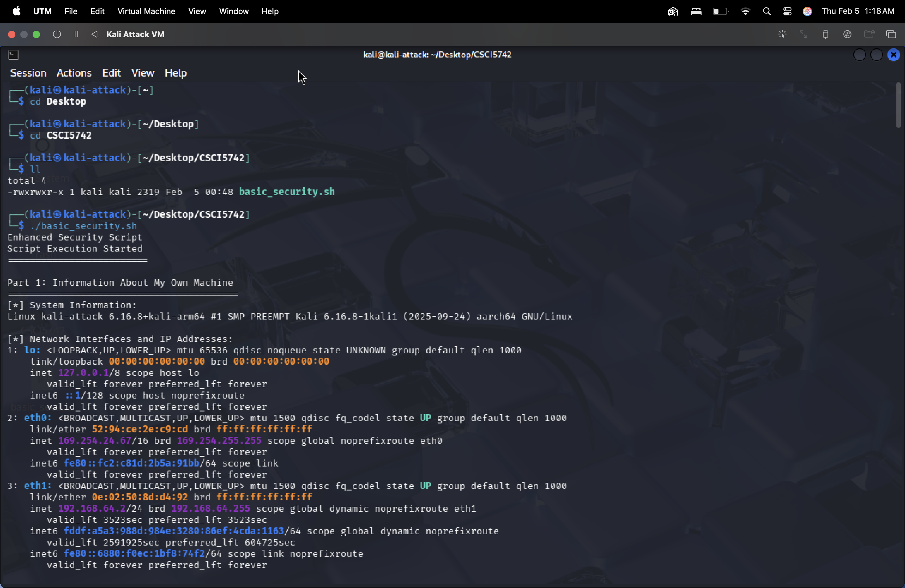

Description:
This screenshot shows the script starting execution successfully.

Screenshot 2: System Information (`uname -a`)
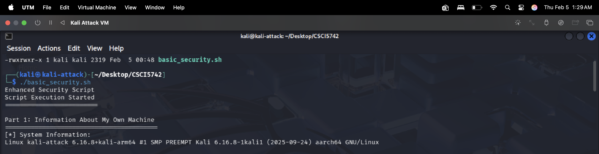

Description:
This screenshot displays basic system information such as the operating system, kernel version, and system architecture.

Screenshot 3: Network Interfaces and IP Addresses (`ip addr show`)
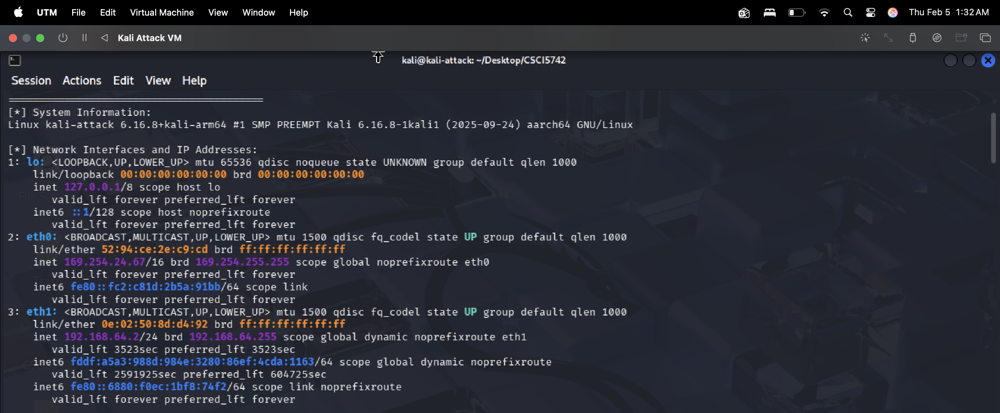

Description:
This screenshot shows all network interfaces on the machine along with their assigned IP addresses.

Screenshot 4: ARP Table (`arp -a`)
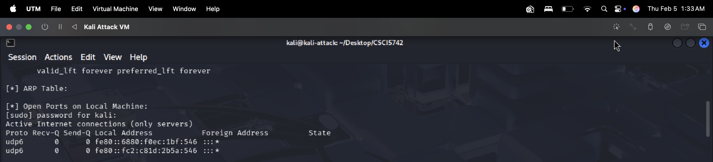

Description:
This screenshot shows the ARP table, which maps IP addresses to MAC addresses on the local network.

Screenshot 5: Open Ports (`netstat -tuln`)
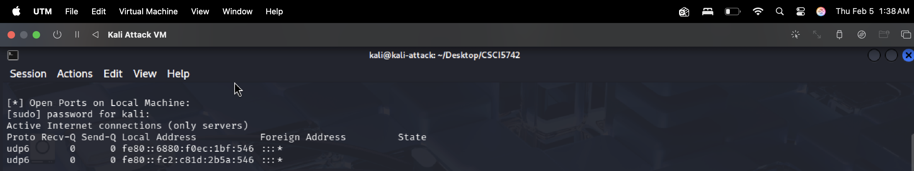

Description:
This screenshot shows the list of open and listening TCP and UDP ports on the local machine.

Screenshot 6: Active Hosts in Subnet (`nmap -sP`)
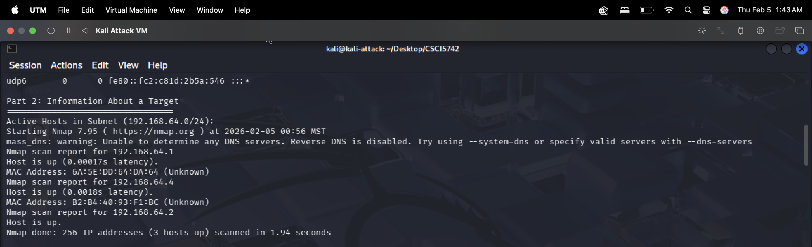

Description:
This screenshot shows the result of a ping scan used to identify active hosts in the subnet.

Screenshot 7: Service Scan on Target (`nmap -sV`)
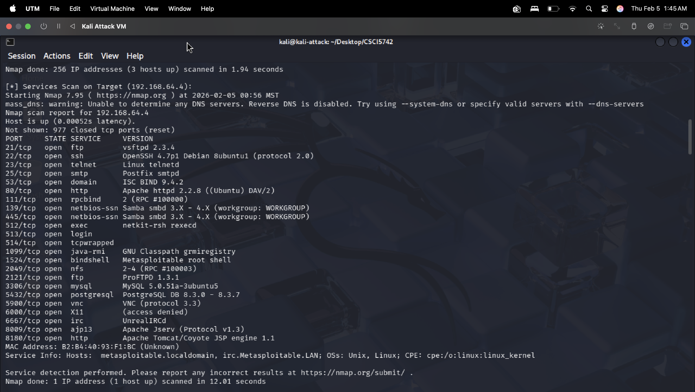

Description:
This screenshot shows open ports on the target machine along with the services and their versions.

Screenshot 8: Vulnerability Scan (`nmap --script vuln`)
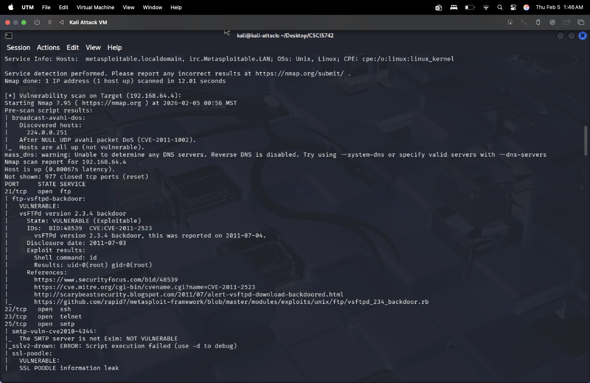
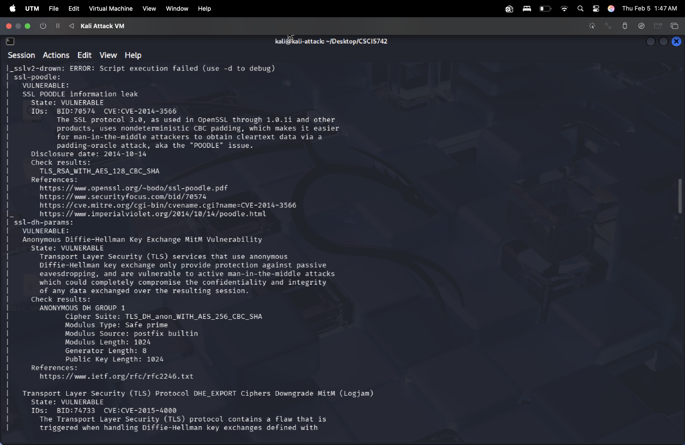
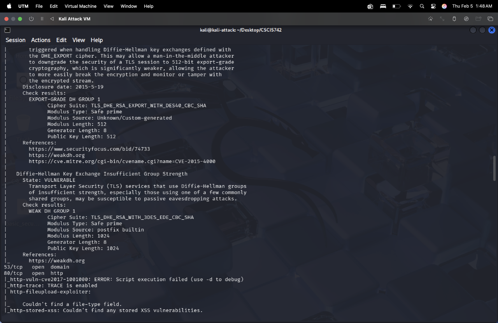
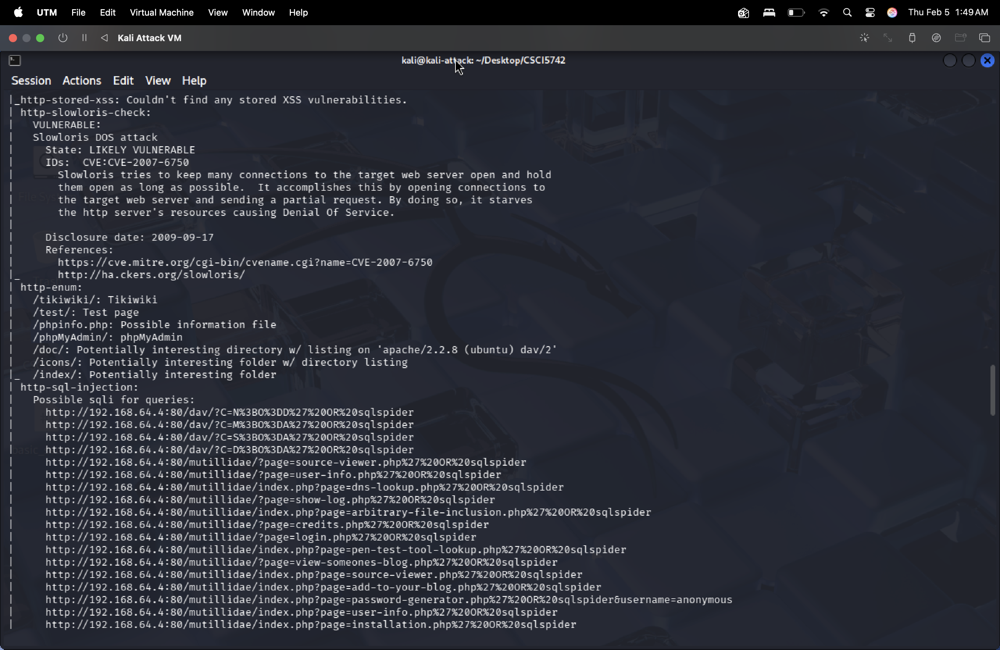
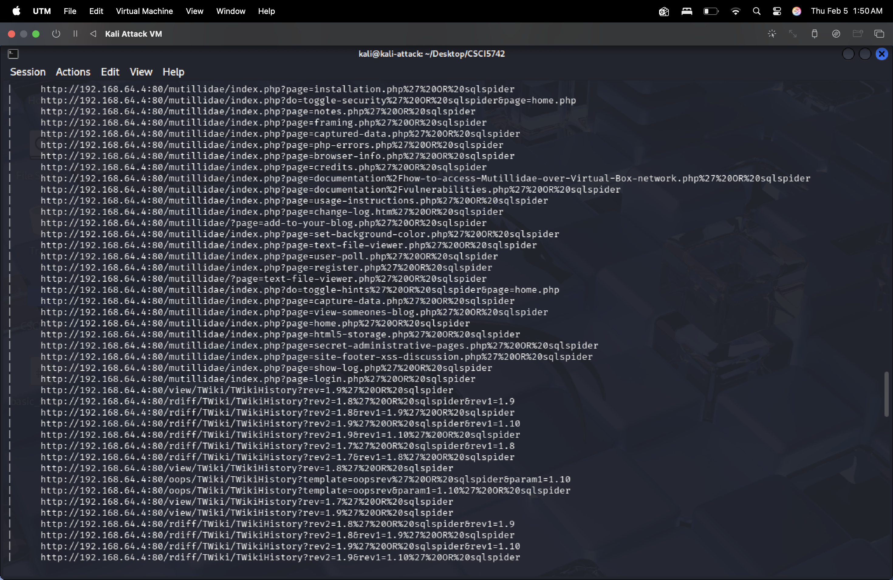
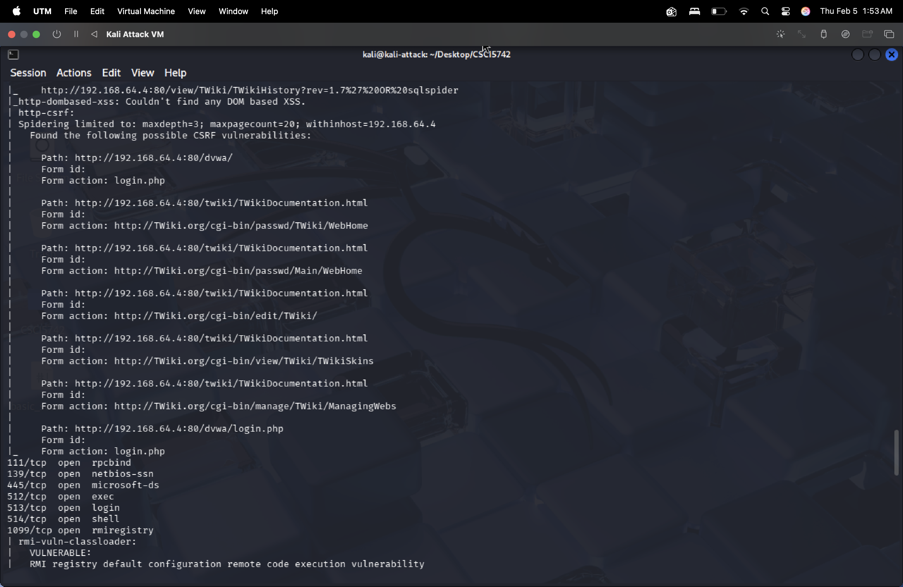
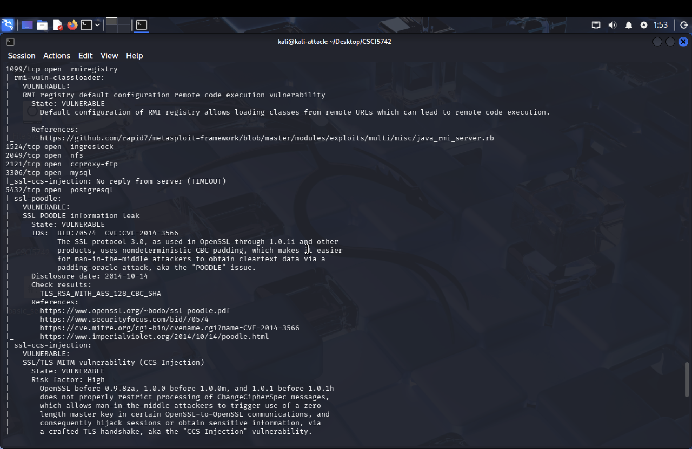
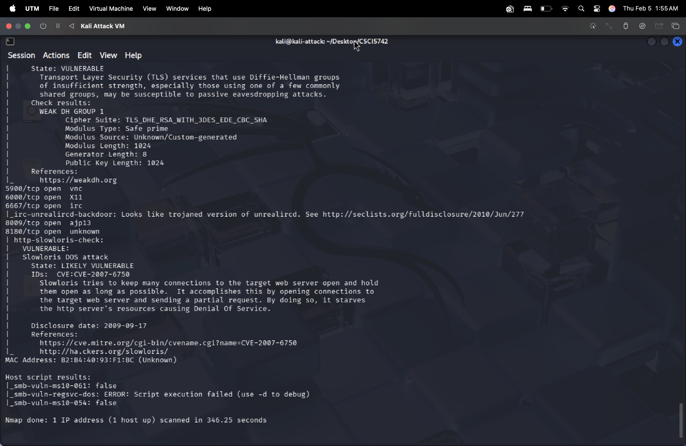

Description:
These screenshots show different parts of the vulnerability scan output, highlighting known security weaknesses on the target system.

Screenshot 9: Script Execution Completed
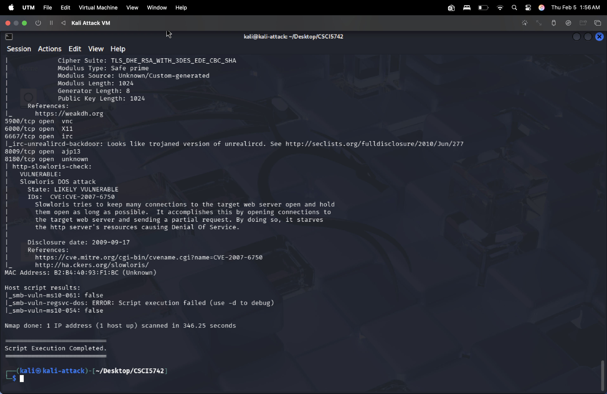
Description:
This screenshot confirms that the script finished running successfully.

### **Summary and Analysis**

##### 1. **Purpose of the Script**:
The purpose of this script is to gather basic system and network information from the local machine and perform reconnaissance on a target system. It collects system details, network configuration, open ports, active hosts, running services, and checks for known vulnerabilities using Nmap.
   
##### 2. **Challenges Faced**:
While working on the script, a small syntax error in one of the commands caused an issue initially, but it was resolved by correcting the command. During the execution of the script and Nmap scans, a DNS resolution issue was encountered where domain names could not be resolved. This was fixed by manually adding DNS server entries to the /etc/resolv.conf file. Public DNS servers (8.8.8.8 and 1.1.1.1) were added as nameserver values, which restored proper DNS resolution. After this change, network connectivity and scans executed correctly without affecting the lab results.
   
##### 3. **Extensions Added**:
An extension was added by including a basic error check for network interface information to prevent script failure if the command is unavailable. Additionally, clear messages such as “Script Execution Started” and “Script Execution Completed” were added to make the script easier to understand.

## **Part 2: CTI Training with MITRE ATT&CK**

### Mapping (5 Behaviors)

#### **Behavior 1**
- **Behavior**:  
  The attackers scanned the internet for vulnerable Ivanti Connect Secure (ICS) VPN appliances using tools such as Nmap, Shodan, and custom Python-based scripts.

- **Mapping Process**:
  1. **Tactic**: Reconnaissance 
     - Objective: Identify vulnerable and high-value targets before exploitation.
  2. **Technique**: Active Scanning (T1595)
     - Sub-Technique: Scanning IP Blocks (T1595.001)
  3. **Justification**:  
     According to the report, the attackers used both open-source tools and custom scripts to scan large IP ranges and fingerprint ICS devices. This behavior fits active scanning because the attackers were actively probing systems to gather technical information about potential targets.

#### **Behavior 2**
- **Behavior**:  
  The attackers exploited a command injection vulnerability (CVE-2024-21887) to execute arbitrary shell commands with administrative privileges.

- **Mapping Process**:
  1. **Tactic**: Privilege Escalation
     - Objective: Gain higher level permissions on the target system to enable full control and support further malicious activity.
  2. **Technique**: Exploitation for Privilege Escalation (T1068) 
     - Sub-Technique: Not Applicable
  3. **Justification**:  
     Exploitation for Privilege Escalation involves taking advantage of software vulnerabilities to elevate permissions. In this case, the threat actors directly exploited a known vulnerability (CVE-2024-21887) to execute arbitrary commands as root. The report clearly states that the attackers abused input validation flaws to gain administrative access, which aligns precisely with the definition and intent of T1068 under the Privilege Escalation tactic.

#### **Behavior 3**
- **Behavior**:  
  The attackers exfiltrated sensitive data using encrypted HTTPS connections over TLS 1.3, disguising the traffic as legitimate API requests.

- **Mapping Process**:
  1. **Tactic**: Exfiltration 
     - Objective: Steal sensitive data while avoiding detection.
  2. **Technique**: Exfiltration Over C2 Channel (T1041)
     - Sub-Technique: Not Applicable
  3. **Justification**:  
     The report describes how stolen data was encrypted and transmitted over HTTPS through command-and-control infrastructure. Using encrypted web traffic to move data out of the network fits exfiltration over a C2 channel.

#### **Behavior 4**
- **Behavior**:  
  The attackers deployed web shells such as LIGHTWIRE and WIREFIRE to remotely execute commands and manipulate files on compromised ICS systems.

- **Mapping Process**:
  1. **Tactic**: Execution 
     - Objective: Execute malicious code on compromised systems.
  2. **Technique**: Command and Scripting Interpreter (T1059)
     - Sub-Technique: Unix Shell (T1059.004)
  3. **Justification**:  
     These web shells provided attackers with the ability to run shell commands remotely. Since the primary function of these tools was command execution, this behavior aligns with execution through a command and scripting interpreter.

#### **Behavior 5**
- **Behavior**:  
  Attackers exploited an authentication bypass vulnerability (CVE-2023-46805) in ICS VPN appliances to gain administrative access without valid credentials.

- **Mapping Process**:
  1. **Tactic**: Initial Access 
     - Objective: Gain unauthorized entry into the target environment.
  2. **Technique**: Exploit Public-Facing Application (T1190)
     - Sub-Technique: Not Applicable
  3. **Justification**:  
     The vulnerability existed in an internet-facing VPN service, and exploiting it allowed the attackers to bypass authentication controls. This directly aligns with exploiting a public-facing application to gain initial access to a system.

### **Summary and Analysis**

##### 1. **Key Adversarial Behaviors**:
In this campaign, the attackers followed a clear step-by-step attack process. They first scanned the internet to find vulnerable Ivanti Connect Secure VPN appliances using tools like Nmap, Shodan, and custom scripts. Once a vulnerable system was found, they exploited public-facing vulnerabilities to gain initial access. After getting inside, they escalated privileges by exploiting a command injection flaw, which allowed them to run commands as an administrator. The attackers then used web shells to remotely execute commands and manage files on the compromised systems. Finally, sensitive data was exfiltrated over encrypted HTTPS connections to avoid detection.
   
##### 2. **Challenges in Mapping Behaviors**:
One challenge in this task was deciding which tactic and technique best fit each behavior, since some actions could reasonably fall under more than one category. For example, exploiting vulnerabilities could be related to both initial access and privilege escalation, depending on the goal of the attacker at that stage. To resolve this, I focused on the attacker’s intent and matched it with the definitions provided in the MITRE ATT&CK framework.
   
##### 3. **Insights and Lessons Learned**:
This lab helped me better understand how real-world attack reports can be broken down into specific adversarial behaviors using the MITRE ATT&CK framework. Instead of viewing the campaign as a single event, ATT&CK makes it easier to see each phase of the attack lifecycle and why attackers perform certain actions. I also learned how common techniques like encrypted C2 traffic and web shells are used to blend malicious activity with normal network behavior. Overall, this exercise improved my ability to analyze threat reports and map attacker behavior.