## **Lab 2 Report**
##### CSCI 5742: Cybersecurity Programming and Analytics, Spring 2026

 

**Name & Student ID**: [Tejal Jadhav], [111530319]

---

## **Part 1: Comprehensive Nmap Scanning**

### **Task 1: Basic Network Discovery (Ping Scan)**

#### **Screenshot**:  
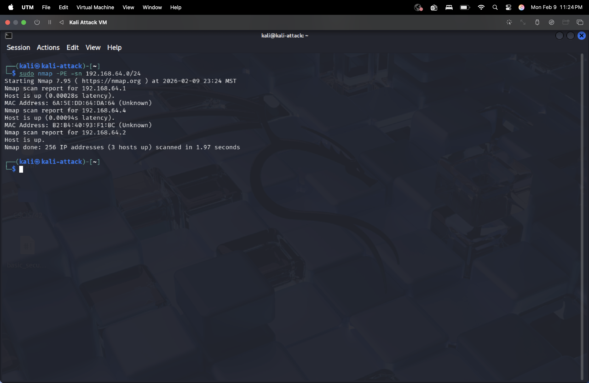

#### **Active Hosts and IP Addresses**:  
  *List all active hosts and their IP addresses.*

- 192.168.64.1
- 192.168.64.2 (Kali Attack VM)
- 192.168.64.4 (Metasploitable-2 VM)

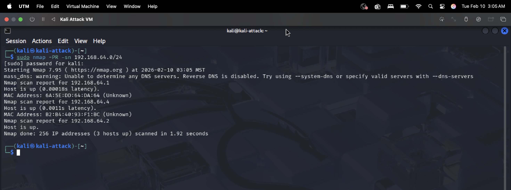
#### **Active Hosts and IP Addresses**:  
- 192.168.64.1
- 192.168.64.2 (Kali Attack VM)
- 192.168.64.4 (Metasploitable-2 VM)

#### Explain the difference between Ping Scan and ARP Scan. 
A ping scan uses ICMP echo requests to check if a host is online. Some systems block ICMP traffic, so a host may not respond even if it is active. An ARP scan uses ARP requests and works only on the local network. It is usually faster and more reliable because ARP traffic is not commonly blocked.

#### Which one is faster in large networks?
ARP scan is faster and more reliable within a local network.

#### Which one only works to discover hosts within the same LAN? Explain.
ARP scan only works within the same local network.

---

### **Task 2: SYN Scan (Stealth Scan)**

#### **Screenshot**:
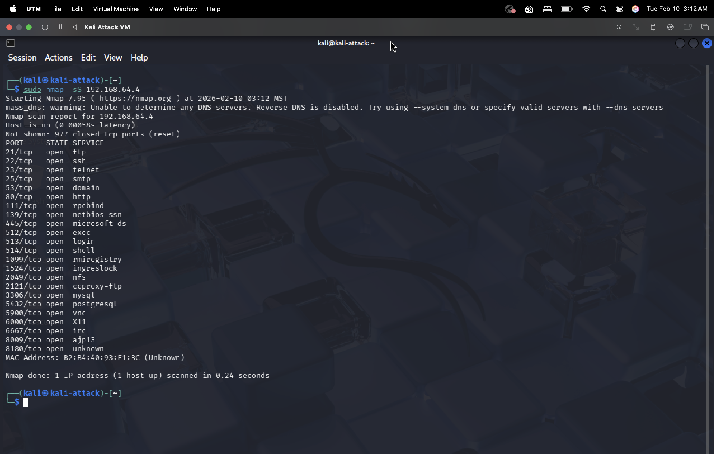

#### **Open Ports Detected**:  
- 21/tcp (ftp)
- 22/tcp (ssh)
- 23/tcp (telnet)
- 25/tcp (smtp)
- 53/tcp (domain)
- 80/tcp (http)
- 111/tcp (rpcbind)
- 139/tcp (netbios-ssn)
- 445/tcp (microsoft-ds)
- 512/tcp (exec)
- 513/tcp (login)
- 514/tcp (shell)
- 1099/tcp (rmiregistry)
- 1524/tcp (ingreslock)
- 2049/tcp (nfs)
- 2121/tcp (ccproxy-ftp)
- 3306/tcp (mysql)
- 5432/tcp (postgresql)
- 5900/tcp (vnc)
- 6000/tcp (X11)
- 6667/tcp (irc)
- 8009/tcp (ajp13)
- 8180/tcp (unknown)

#### Explanation of SYN Scan's Stealth Advantage**:  
A SYN scan is preferred for stealthy reconnaissance because it does not complete the full TCP connection. It only sends a SYN packet to check if a port is open and then stops, which makes the scan less noticeable and harder to detect.
---

### **Task 3: TCP Connect Scan**

#### **Screenshot**:
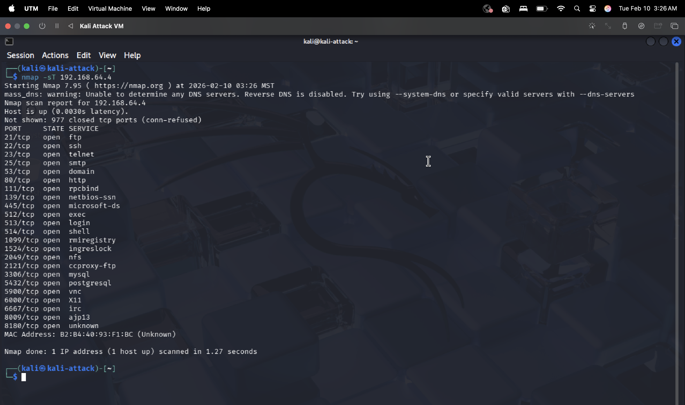  

#### **Comparison with SYN Scan**:
The TCP connect scan found the same open ports as the SYN scan on the Metasploitable-2 system, which shows that both scans can identify open TCP ports. The difference is that the TCP connect scan completes the full TCP connection for each port, making it easier for the target system to notice and log the activity. On the other hand, the SYN scan does not complete the full connection, which makes it more stealthy. Overall, the SYN scan is better for stealthy reconnaissance, while the TCP connect scan is simpler but more detectable. 

---

### **Task 4: Service Detection**

#### **Screenshot**:
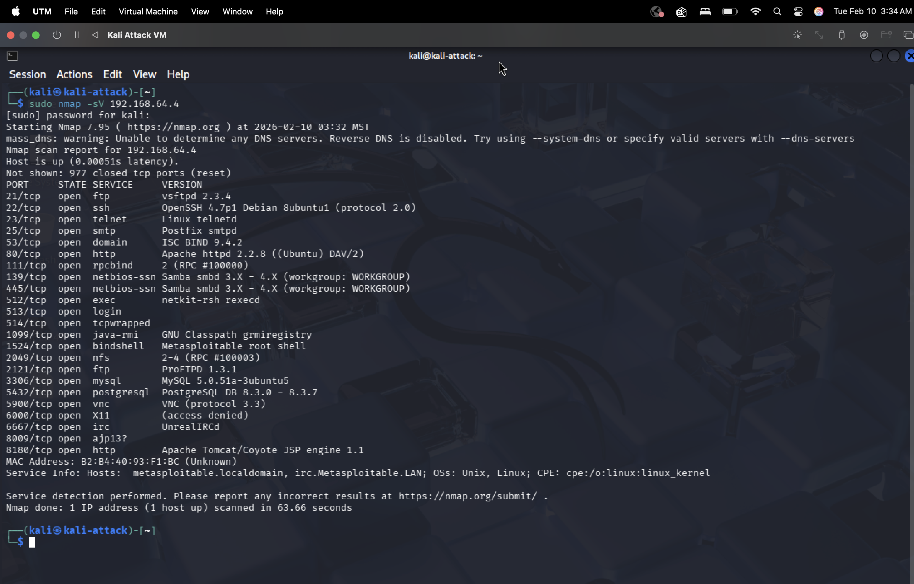

#### **Detected Services and Versions**:  
  *List detected services and their versions.*
21/tcp   open  ftp         vsftpd 2.3.4
22/tcp   open  ssh         OpenSSH 4.7p1 Debian 8ubuntu1 (protocol 2.0)
23/tcp   open  telnet      Linux telnetd
25/tcp   open  smtp        Postfix smtpd
53/tcp   open  domain      ISC BIND 9.4.2
80/tcp   open  http        Apache httpd 2.2.8 ((Ubuntu) DAV/2)
111/tcp  open  rpcbind     2 (RPC #100000)
139/tcp  open  netbios-ssn Samba smbd 3.X - 4.X (workgroup: WORKGROUP)
445/tcp  open  netbios-ssn Samba smbd 3.X - 4.X (workgroup: WORKGROUP)
512/tcp  open  exec        netkit-rsh rexecd
513/tcp  open  login
514/tcp  open  tcpwrapped
1099/tcp open  java-rmi    GNU Classpath grmiregistry
1524/tcp open  bindshell  Metasploitable root shell
2049/tcp open  nfs        2-4 (RPC #100003)
2121/tcp open  ftp        ProFTPD 1.3.1
3306/tcp open  mysql      MySQL 5.0.51a-3ubuntu5
5432/tcp open  postgresql PostgreSQL DB 8.3.0 - 8.3.7
5900/tcp open  vnc        VNC (protocol 3.3)
6000/tcp open  X11        (access denied)
6667/tcp open  irc        UnrealIRCd
8009/tcp open  ajp13?
8180/tcp open  http       Apache Tomcat/Coyote JSP engine 1.1

---

### **Task 5: OS Detection**

#### **Screenshot**:
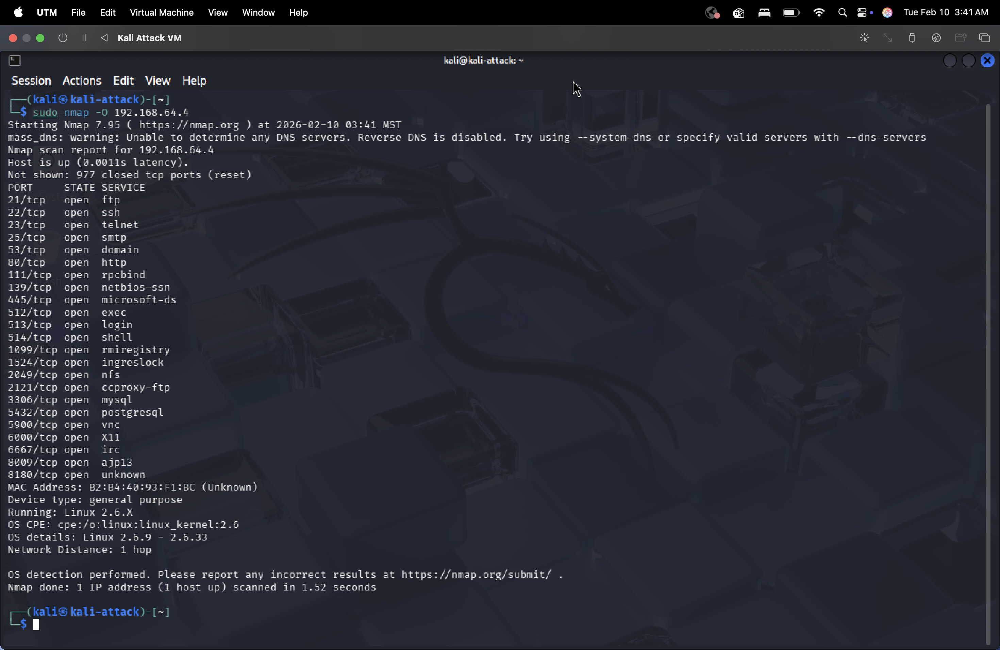

#### **Detected OS and Accuracy**: 
The OS detection scan shows that the target machine is running Linux with a 2.6.x kernel.
Nmap identified the OS as Linux 2.6.9 to 2.6.33, which matches the Metasploitable-2 system.
Since the scan was done on the same local network and Nmap confidently matched the OS fingerprint, the result is considered accurate. 

---

### **Task 6: Timing Profiles**

#### **Screenshot for T1 (Paranoid Mode)**:
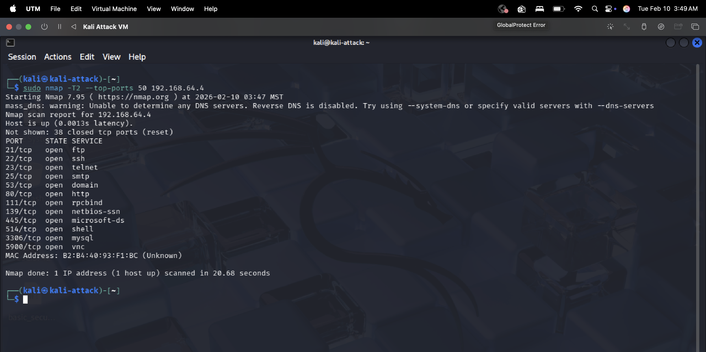

#### **Screenshot for T3 (Normal Mode)**:
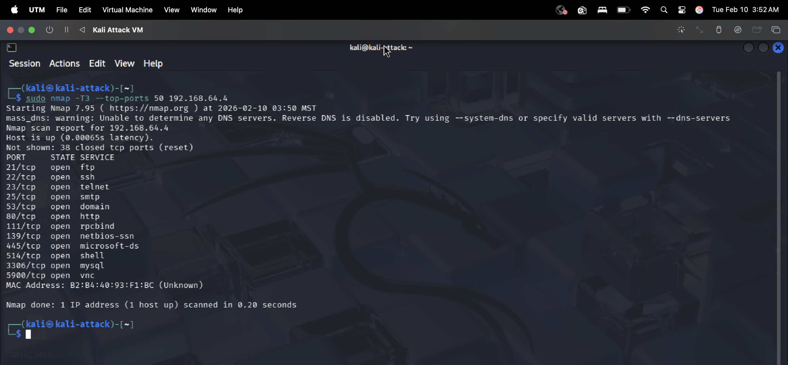

#### **Analysis of Timing Profiles**:  
In the T2 (Paranoid) scan, the scan took much longer to complete. This is because Nmap sends packets very slowly, which helps avoid detection.
In the T3 (Normal) scan, the scan finished very quickly. This mode is faster but more noticeable on the target system.
Both scans detected the same open ports, but the difference was in scan speed and stealth. Overall, T2 is slower and stealthier, while T3 is faster but less stealthy.

---

### **Task 7: UDP Scan**

#### **Screenshot**:
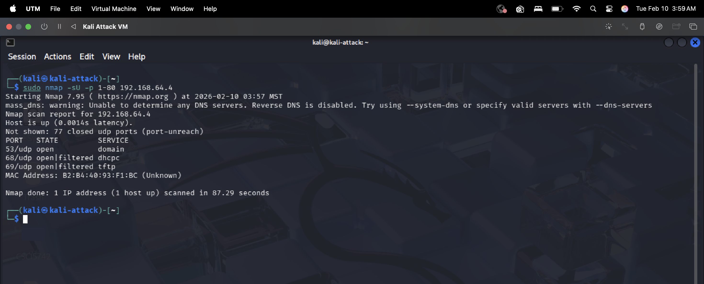

#### **Open UDP Ports**:  
*List detected open UDP ports.*
- 53/udp – open – domain (DNS)
- 68/udp – open|filtered – dhcpc
- 69/udp – open|filtered – tftp

---

### **Task 8: Vulnerability Scan**

#### **8.1 General Vulnerability Scan (`--script vuln`)**
##### **Screenshot**:  
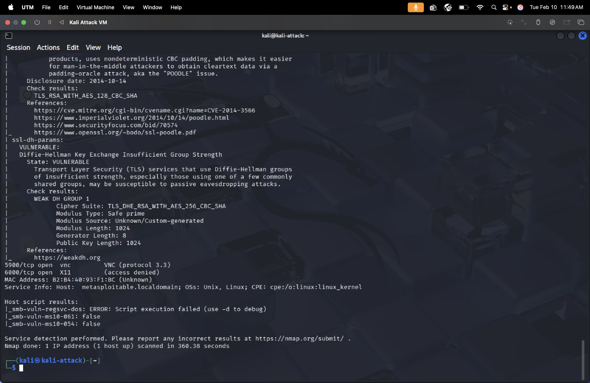

##### **Summary**:
The vulnerability scan shows that the system is running old and insecure configurations. Because of this, attackers could intercept data or exploit the services running on the machine. Most of the problems are related to weak encryption settings.

##### **Answer to Questions**:

**Which top 2 findings appear most critical, and why (impact + exposure)?**
1. SSL POODLE Vulnerability (CVE-2014-3566) - 
    This vulnerability affects how SSL encryption works. An attacker can read sensitive information by exploiting weak encryption. This is critical because encryption is supposed to protect data like passwords and sessions.
2. Weak Diffie-Hellman Key Exchange -
    The system uses weak encryption keys.
    Attackers can break or listen to encrypted communication.
    This puts all secure services on the system at risk.

**Which finding is most actionable to fix first, and why?**
  It can be fixed easily by disabling weak encryption and using stronger keys. Fixing it improves security for all encrypted connections. It reduces the chance of attackers intercepting network traffic.

---
#### **8.2 Vulners Vulnerability Scan (`--script vulners`)**
##### **Screenshot**:
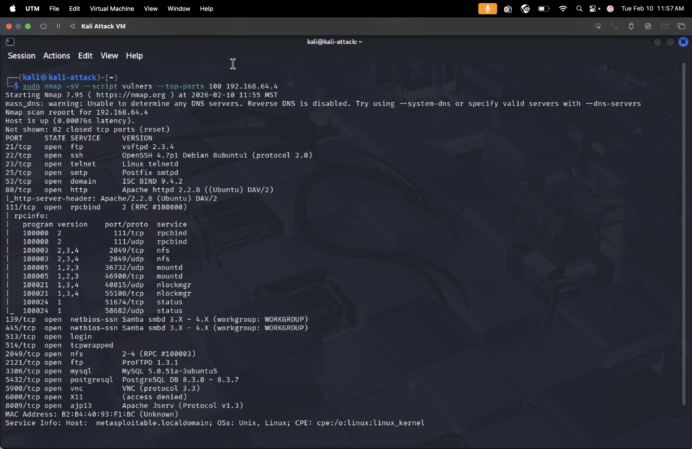
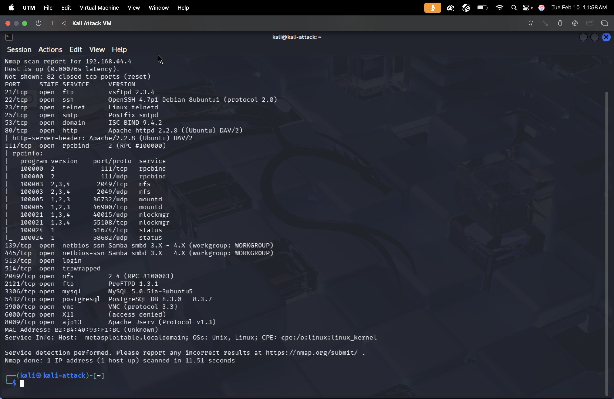

##### **Summary**:
The Vulners scan identified multiple vulnerabilities by mapping detected service versions to known CVEs. Several services such as FTP, Apache HTTP, Samba, and database services are running outdated versions, which are associated with known security vulnerabilities.

##### **Answer to Questions**:  

**List the top 3 CVEs reported (or the 3 highest-severity entries) and specify the service/port each is tied to.**

1. CVE-2011-2523 – FTP (Port 21, vsftpd 2.3.4) - Allows attackers to gain remote shell access through a backdoor. High risk because FTP is openly accessible.

2. CVE-2014-3566 (POODLE) – SSL/TLS services (HTTPS-related services) - Exploits weak SSL encryption to decrypt sensitive data. High impact due to potential data exposure.

3. Multiple Samba CVEs – SMB (Ports 139/445) - Old Samba versions are vulnerable to unauthorized access and privilege escalation. High exposure because SMB services are open.

**Compare Vulners vs --script vuln: identify one finding that appears in both outputs, and one that appears in only one output. Explain why that difference might happen.**

**Finding present in both scans:** Outdated services like FTP (vsftpd 2.3.4) and Samba SMB appear in both outputs. This happens because both scans detect well-known vulnerable services.

**Finding present only in Vulners scan:** Detailed CVE listings with IDs and severity levels appear mainly in the Vulners output. This is because Vulners maps service versions to CVE databases, while --script vuln focuses more on active vulnerability checks.

#### **8.3 SMB Checks (139/445)**
##### **Screenshot**:

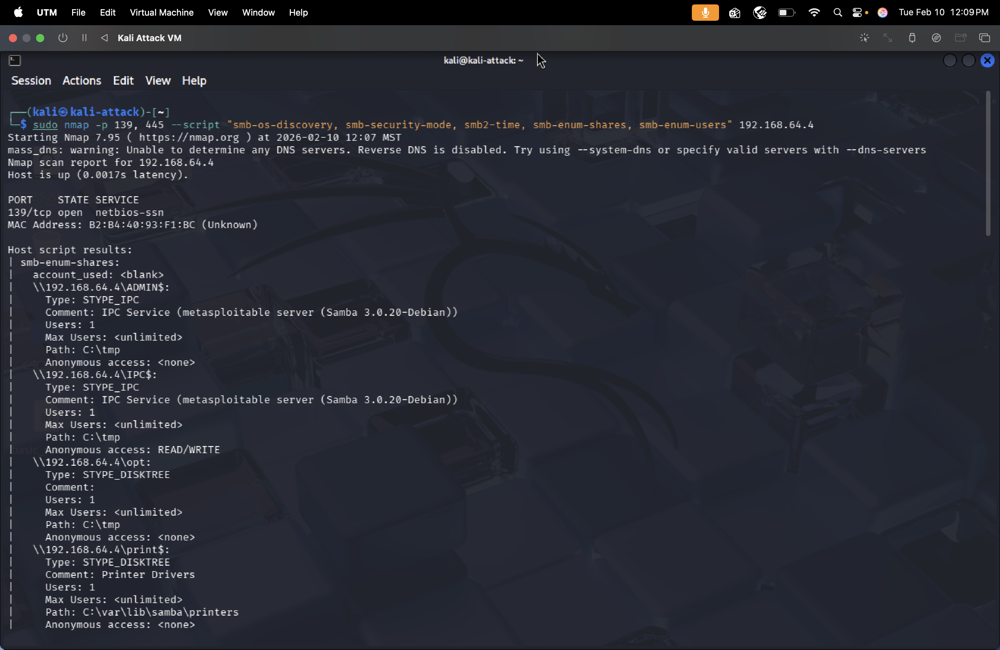
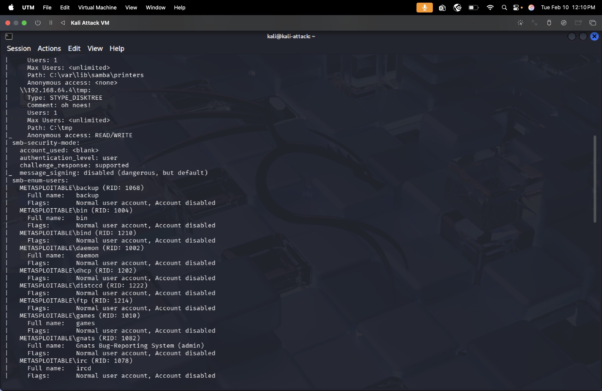
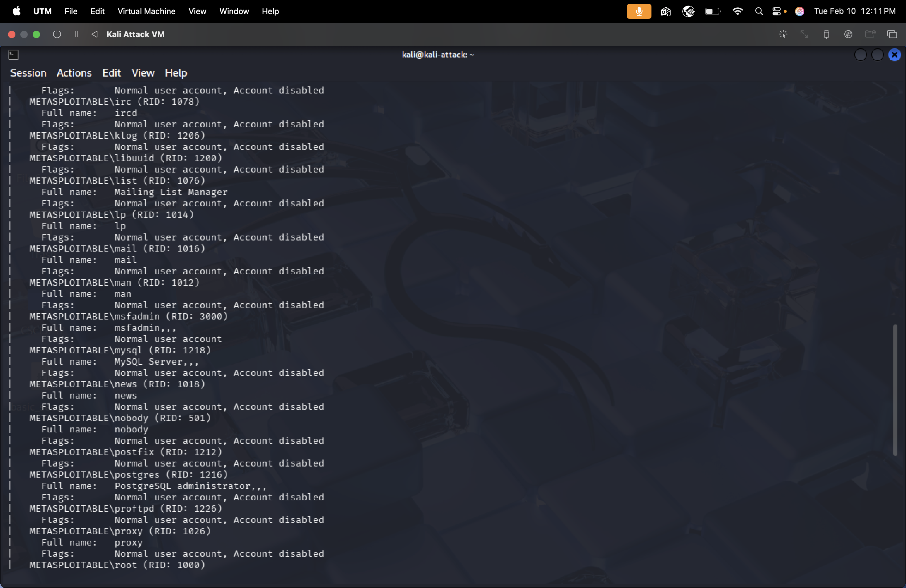
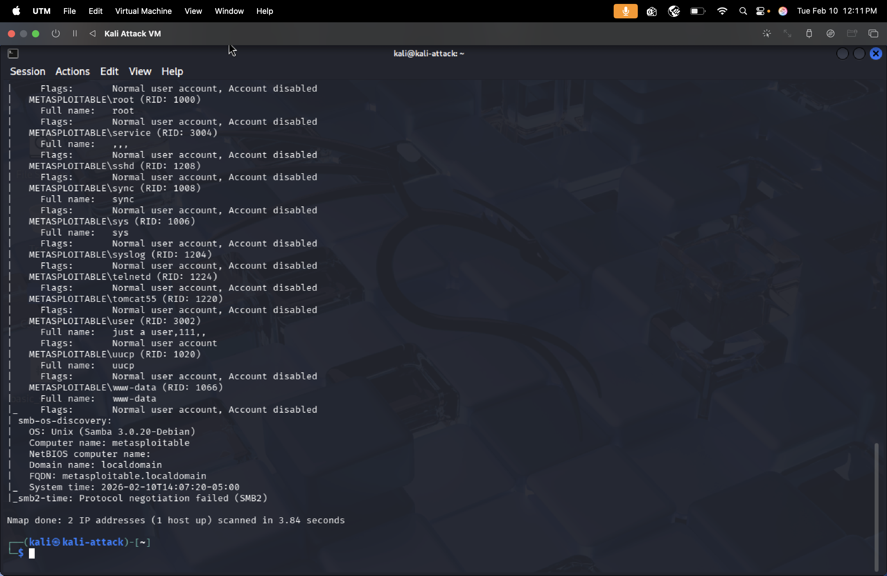

##### **Summary**:
The SMB scan revealed that the target system is running Samba 3.0.20 on a Linux-based operating system. SMB services were accessible on port 139, and multiple SMB shares and user accounts were successfully enumerated. SMB message signing was found to be disabled, which makes the service less secure.

##### **Answer to Questions**:

**What information was revealed about the host (e.g., OS/host details)?**
1. Operating System: Linux (Samba 3.0.20-Debian)
2. Computer Name: metasploitable
3. Domain Name: localdomain
4. SMB service is running and accessible
5. SMB message signing is disabled

**Were any shares/users enumerated? If yes, list them and explain why this is risky.**
Shares discovered: ADMIN$, IPC$, opt, print$, tmp (READ/WRITE access enabled)

Users discovered: Multiple system and service accounts such as root, ftp, mysql, postgres, www-data, and others.

This is risky beacuse:  
1. Open SMB shares can let attackers view or change files on the system
2. The tmp share allows read and write access, which could be misused to upload malicious files
3. Knowing valid usernames makes it easier for attackers to try password guessing or privilege escalation
4. SMB signing is disabled, which increases the risk of man-in-the-middle attacks

---

#### **8.4 FTP Checks (21)**
##### **Screenshot**: 
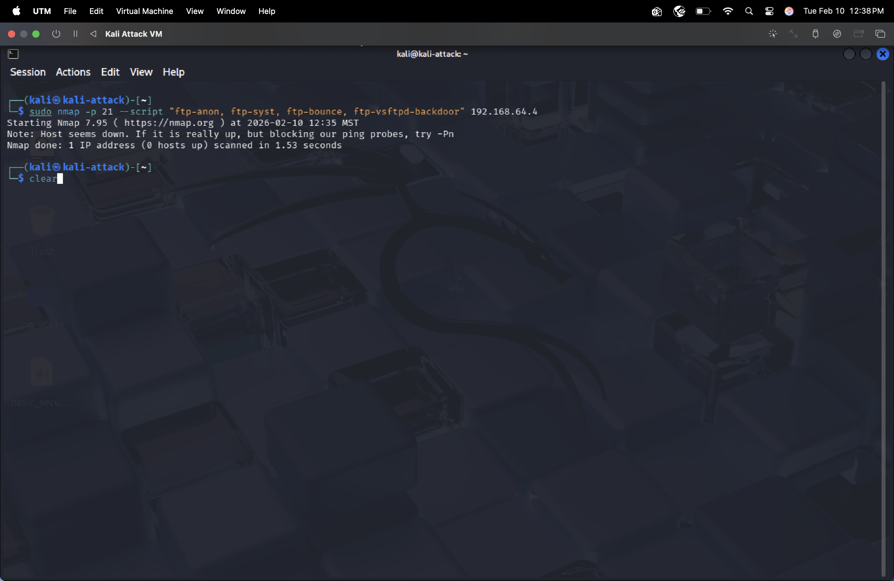

##### **Summary**:
An FTP scan was run on port 21 using multiple Nmap FTP scripts (ftp-anon, ftp-syst, ftp-bounce, ftp-vsftpd-backdoor). Nmap reported that the host appears down, likely because it is blocking ICMP (ping) probes. Due to this, the FTP scripts could not fully interact with the service.

##### **Answer to Questions**:

**Is anonymous FTP login allowed? Provide evidence from the output.**
got Host seems down. If it is really up, but blocking our ping probes, try -Pn means the host was not detected as “up,” the ftp-anon script could not confirm whether anonymous login is enabled.

**What banner/version is shown, and why does version disclosure matter?**
Not detected. Since the scan did not receive a response from the FTP service, no banner or version information was returned. This disclosure matters because if an FTP banner and version are exposed, attackers can easily identify known vulnerabilities for that specific version (such as backdoors or remote code execution flaws). In this case, version information could not be obtained due to scan limitations.

---

#### **8.5 SSH Configuration Checks (22)**
##### **Screenshot**:
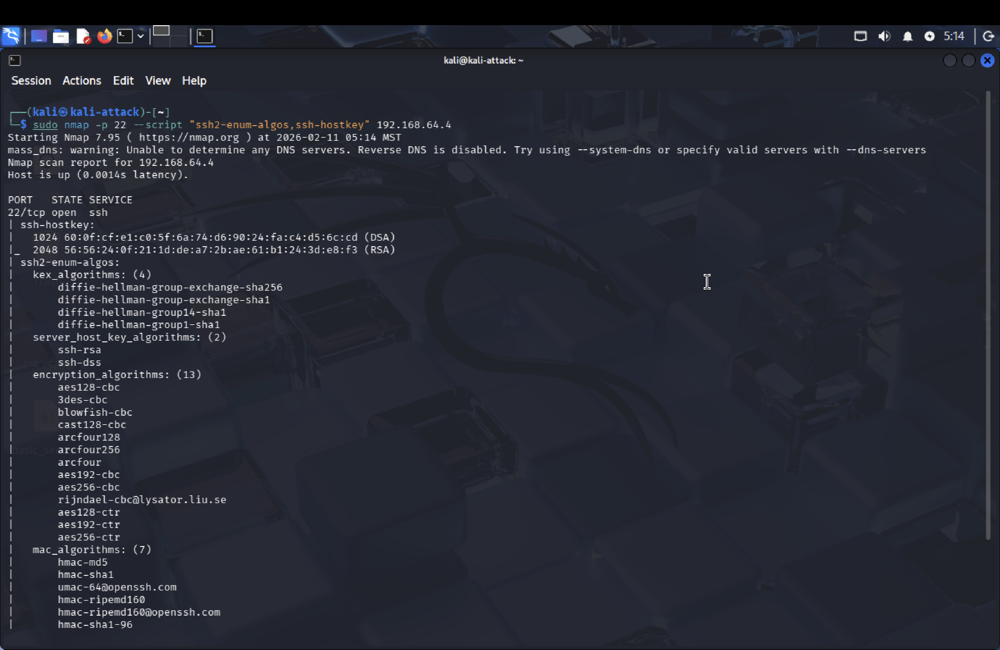
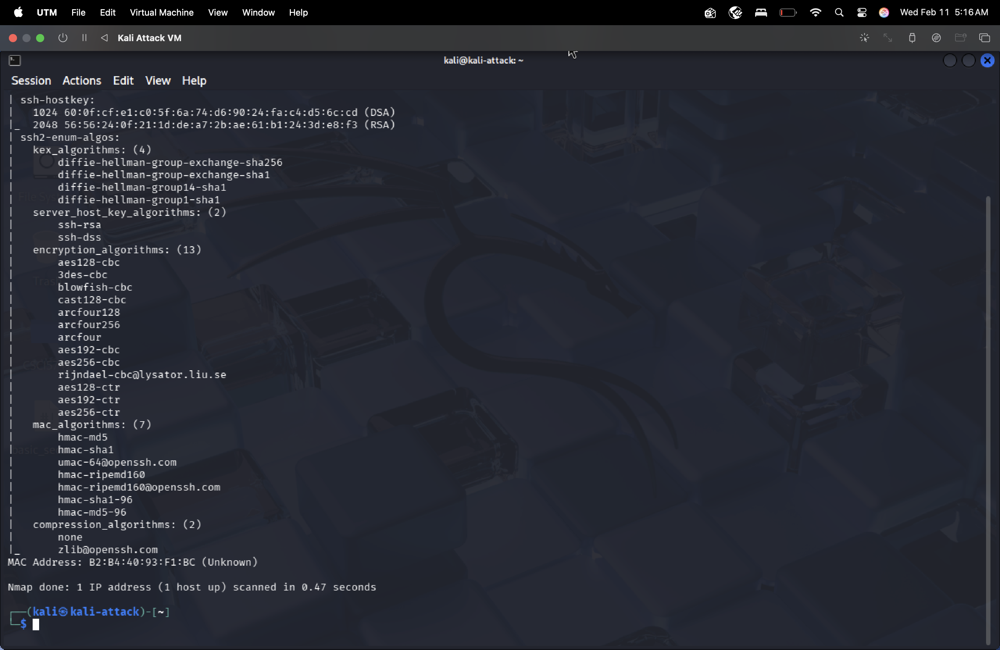

##### **Summary**:
The SSH service is running on port 22 and supports multiple key exchange, encryption, and MAC algorithms. The scan shows both modern and older cryptographic algorithms enabled. Some stronger algorithms like:
- ecdh-sha2-nistp256
- aes128-ctr
- aes256-ctr are present, which is good. However, older and weaker algorithms are also supported, which creates security concerns.

**List supported algorithms; explain why weak/legacy algos matter.**

Key Exchange (KEX)
- diffie-hellman-group1-sha1
- diffie-hellman-group14-sha1
- diffie-hellman-group-exchange-sha1
- diffie-hellman-group-exchange-sha256

Host Key
- ssh-rsa
- ssh-dss

Encryption Ciphers
- 3des-cbc
- blowfish-cbc
- aes128-cbc
- aes192-cbc
- aes256-cbc
- aes128-ctr
- aes256-ctr

MAC Algorithms
- hmac-md5
- hmac-sha1
- hmac-ripemd160

##### **Answer to Questions**:  

**Which key exchange / cipher / MAC options suggest legacy or weak configuration (if any)?**

Weak Key Exchange:
- diffie-hellman-group1-sha1 (very old and weak)
- diffie-hellman-group14-sha1 (uses SHA1, considered weak)

Weak Ciphers:
- 3des-cbc (old and slow)
- blowfish-cbc
- CBC mode ciphers (vulnerable to certain attacks)

Weak MACs:
- hmac-md5
- hmac-sha1 (SHA1 is deprecated)

**Why can supporting older algorithms increase risk?**

Older algorithms like SHA1, MD5, and group1 Diffie-Hellman are considered insecure today. They are vulnerable to cryptographic attacks. Can allow attackers to downgrade connection. May allow brute-force or collision attacks. Reduce overall encryption strength. If an attacker forces the server to use a weak algorithm, the encrypted communication could be compromised.
---

#### **8.6 Web Server Enumeration (80)**
##### **Screenshot**:  
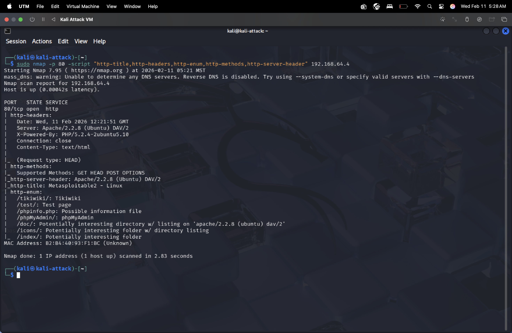

##### **Summary**:
Port 80 is open and running Apache/2.2.8 (Ubuntu) with PHP 5.2.4. The server is outdated and exposes multiple directories.

**List discovered paths (e.g., phpMyAdmin / Mutillidae), methods allowed, and any notable headers.**

- Discovered Paths
/tikiwiki/
/test/
/phpinfo.php
/phpMyAdmin/
/doc/
/icons/
/index/

- HTTP Methods Allowed
GET, HEAD, POST, OPTIONS
POST can be risky if input validation is weak.

- Notable Server Details

Server header shows:
Apache/2.2.8 (Ubuntu)
PHP/5.2.4
##### **Answer to Questions**:  

**What paths/directories were discovered (e.g., /phpmyadmin/, /mutillidae/)?**
/tikiwiki/, /phpMyAdmin/, /phpinfo.php/, /test/, /doc/, /icons/, /index/

**What HTTP methods are allowed (if shown), and why can this matter?**
GET, HEAD, POST, OPTIONS. POST allows data submission, which can lead to attacks if not secured properly.

**Identify one missing/weak header or notable server detail (if shown) and explain its security relevance.**
The server reveals exact Apache and PHP versions. This makes it easier for attackers to find known exploits.

---

#### **8.7 HTTP Auth / Default Accounts (80)**
##### **Screenshot**:
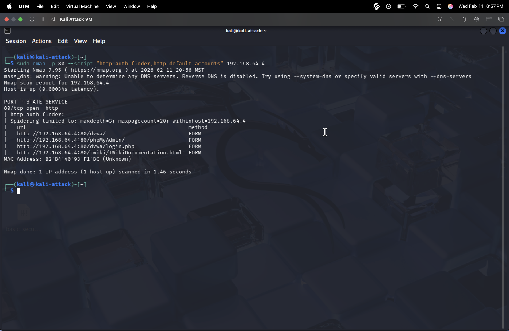

##### **Summary**:  
The scan showed that port 80 (HTTP) is open and several authentication-related endpoints were found. Nmap detected login pages such as:
- /dvwa/
- /dvwa/login.php
- /phpMyAdmin/
- /tikiwiki/TikiWikiDocumentation.html
These paths indicate that web applications with login forms are running on the server. Even though no password testing was done, the presence of these common applications suggests possible default credential risks.

**Report any hints of default accounts/endpoints (no brute forcing).**
The scan did not directly confirm any default usernames or passwords. However, it identified authentication endpoints such as: /dvwa/, /dvwa/login.php, /phpMyAdmin/, /tikiwiki/. These applications are commonly associated with default credentials if not properly secured. Although no brute forcing was performed, the presence of these login pages suggests a potential risk of default accounts being used.

##### **Answer to Questions**:  

**Did Nmap indicate any authentication endpoints or default account hints? Summarize.**
Yes. Nmap detected several authentication endpoints such as /dvwa/, /dvwa/login.php, /phpMyAdmin/, and /tikiwiki/. These pages contain login forms, which means authentication is required. Although the scan did not confirm specific default usernames or passwords, these applications are commonly known to have default credentials if not properly configured.

**Why are default credentials a high-risk exposure even if the service is “internal”?**
Default credentials are risky because they are widely known and easy to guess. If an attacker gains access to the internal network, they can quickly log in without needing advanced techniques. Internal systems are often less monitored, so default credentials can easily lead to unauthorized access and full system compromise.

---

### **Task 9: Banner Grabbing**

#### **Screenshot**:
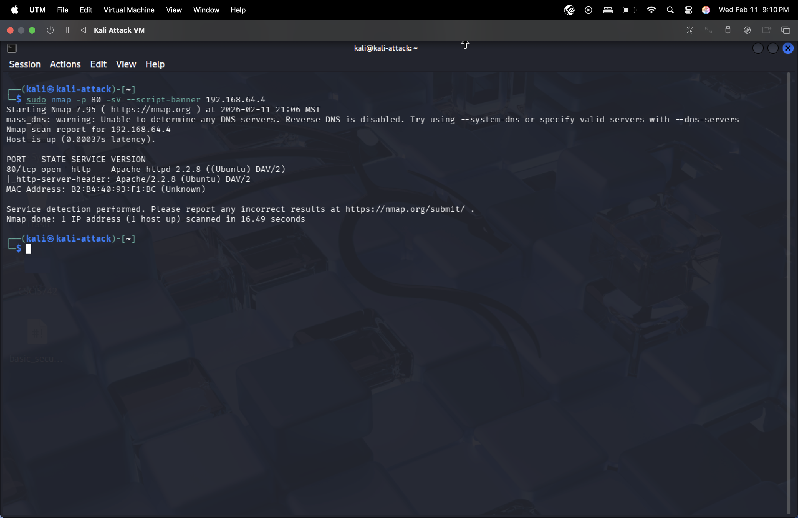

#### **Extracted Banner**:  
  *Document the banner retrieved from port 80 and its significance.*

  The banner retrieved from port 80 is: Apache httpd 2.2.8 ((Ubuntu) DAV/2). The banner shows that the web server is running Apache version 2.2.8 on Ubuntu, and it has DAV/2 (WebDAV) enabled. This is important because the exact server version is exposed, which helps attackers look up known vulnerabilities for Apache 2.2.8. Apache 2.2.8 is an old and outdated version, meaning it may contain known security flaws. WebDAV (DAV/2) can sometimes allow file uploads or remote modifications if not properly secured. Exposing banner information makes the system easier to target.

---

### **Part 1 Summary and Analysis**
In Part 1, multiple Nmap scans were performed on the Metasploitable-2 system to identify open ports, running services, and potential security weaknesses. The scans revealed several open ports such as FTP (21), SSH (22), HTTP (80), and SMB (139/445). Many of these services are running outdated versions, including Apache 2.2.8 and vsftpd 2.3.4, which are known to contain vulnerabilities. Service and vulnerability scans identified weak configurations, such as legacy encryption algorithms in SSH and exposed SMB shares. Web enumeration discovered sensitive directories like /phpMyAdmin/ and /dvwa/, which increase the attack surface. Banner grabbing also showed that the server exposes its version information, making it easier to identify known exploits. Overall, Part 1 demonstrates that outdated services, exposed applications, and weak configurations significantly increase security risks. Proper updates, secure configurations, and limiting exposed services are important to reduce vulnerabilities.

---

## **Part 2: Python Port Scanner Development**

### **Task 1: TCP Scanner**

#### **Screenshot**:
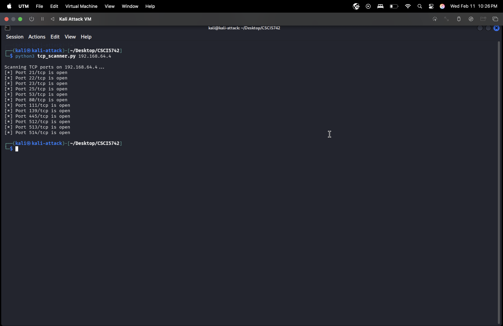

#### **Answers to Questions**: 
**Why do we need to create a socket using socket.AF_INET and socket.SOCK_STREAM?**
AF_INET is used for IPv4 addresses. SOCK_STREAM is used because TCP is a stream-based protocol. Together they create a TCP socket for IPv4 communication.

**What does settimeout(1) do for the TCP socket?**
It makes the socket wait only 1 second for a response. If no response comes, it stops waiting. This makes the scanner faster.

**What types of exceptions might occur in the except block?**
Connection refused, timeout errors, unreachable host, or other network-related errors.

**Why is it important to handle exceptions in network programming?**
Because network connections can fail for many reasons. If we don’t handle exceptions, the program will crash.

**Why do we check for command-line arguments using len(sys.argv)?**
To make sure the user provides the target IP address when running the script.

**What happens if no arguments are passed to the script?**
It prints the usage message and exits.

**Why do we loop through the port range (1, 1024)? What are these ports called?**
Ports 1–1024 are called well-known ports. Common services like SSH (22), HTTP (80), FTP (21) run in this range.

**Does running this script require sudo? Why or why not?**
No, sudo is not required because we are using normal TCP connect scanning, not raw packets. Regular users can create TCP sockets.

---

### **Task 2: UDP DNS Port Scanner**

#### **Screenshot**:  
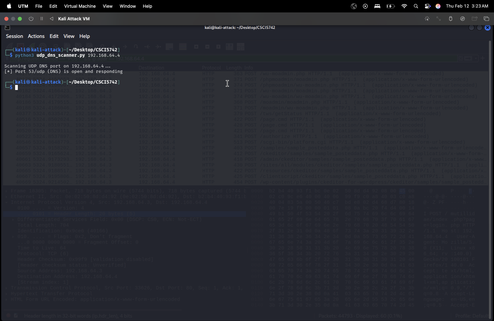

#### **Answers to Questions**:  

**Why do we use socket.SOCK_DGRAM for UDP scanning?**
We use socket.SOCK_DGRAM because UDP uses datagram-based communication instead of a connection like TCP. Since DNS runs over UDP, we need a UDP socket to send and receive packets correctly.

**What does the timeout argument achieve for the socket?**
The timeout sets how long the program waits for a response. If no response is received within that time, the socket raises a timeout exception. This prevents the script from waiting forever.

**What is the purpose of the query variable, and why does it contain these specific bytes?**
The query variable contains a raw DNS request packet. These specific bytes represent a properly formatted DNS query asking for the IP address of example.com. It is used to check if the DNS server responds correctly.

**Why do we use recvfrom(512) to read responses? What does 512 represent?**
We use recvfrom(512) to receive up to 512 bytes from the server. The value 512 represents the standard maximum size of a DNS response packet over UDP.

**Why is a timeout exception likely in UDP scanning?**
UDP does not guarantee a response. If a port is closed or filtered, the server may not reply at all. Because of this, timeouts are common in UDP scanning.

**Why is it important to close the socket in the finally block?**
The finally block ensures the socket is closed no matter what happens. This prevents resource leaks and keeps the system stable.

**What is the purpose of sys.argv in the main function?**
sys.argv is used to take input from the command line. It allows the user to provide the target IP address when running the script.

**Why is input validation important in this case?**
Input validation ensures the user provides the correct number of arguments. If no IP address is given, the script shows proper usage instead of crashing.

**Does running this script require sudo? Why or why not?**
No, sudo is not required. The script uses normal UDP sockets and does not require raw packet access. Sudo is only needed for raw socket scanning like SYN scans.

---

### **Part 2 Summary and Analysis**

In Part 2, a custom Python port scanner was developed to understand how network scanning works at a basic level. The TCP scanner checks ports 1–1023 by creating a TCP socket and attempting to connect to each port. If the connection is successful, the port is identified as open. This demonstrates how TCP scanning relies on completing a connection handshake to determine port status. A UDP DNS scanner was also implemented to scan port 53. Unlike TCP, UDP does not establish a connection, so a DNS query packet was manually created and sent to the target. If a response is received, the port is considered open. This highlights how UDP scanning is more challenging because many services may not respond, which often results in timeouts. Overall, this part helped in understanding the difference between TCP and UDP scanning, how sockets work in Python, how timeouts prevent the script from hanging, and why proper exception handling is important in network programming.

---

## **Part 3: Wireshark Analysis of Scanning Traffic**

### **Task 1: Setup Wireshark for Packet Capture**

#### **Screenshot**:
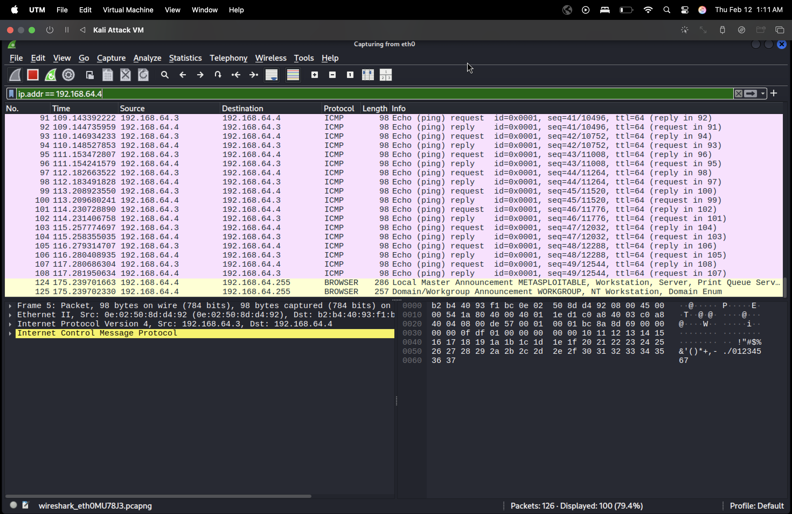

---

### **Task 2: Analyze SYN Scan Traffic**

#### **Screenshot (SYN Packets)**: 
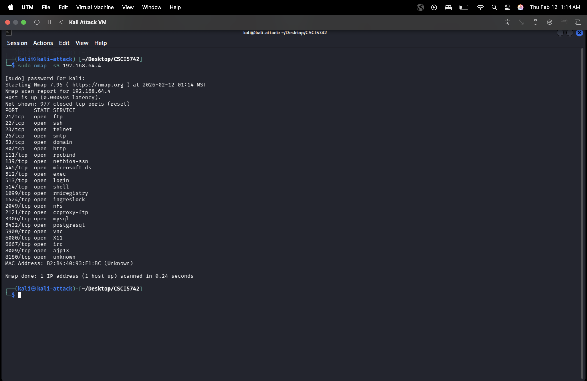

#### **Screenshot (SYN-ACK and RST Responses)**:
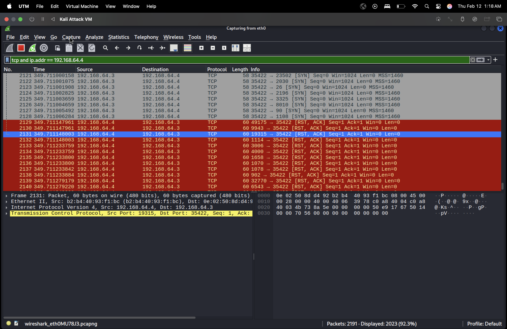

**Identify Open and Closed Ports:Open ports respond with SYN-ACK.Closed ports respond with RST.**

Open and closed ports can be identified by looking at the response to the SYN packet in Wireshark. If the target replies with SYN-ACK, the port is open. If the target replies with RST (or RST-ACK), the port is closed.
So,  SYN -> SYN-ACK = Open
SYN -> RST = Close

#### **Answers to Questions**: 

**What distinguishes open ports from closed ports in the Wireshark capture?**
In Wireshark, open ports reply with SYN-ACK after receiving a SYN packet.
Closed ports reply with RST (Reset).
So, SYN -> SYN-ACK = Open
SYN -> RST = Closed

**How does the TCP three-way handshake differ in a SYN scan?**
In a normal TCP connection, the full handshake happens: SYN -> SYN-ACK -> ACK. In a SYN scan, the connection is not completed. After receiving SYN-ACK, the scanner sends RST instead of ACK. That is why a SYN scan is called a half-open scan.

---

### **Task 3: Inspect UDP DNS Scanning Traffic**

#### **Screenshot (UDP Packets)**:  
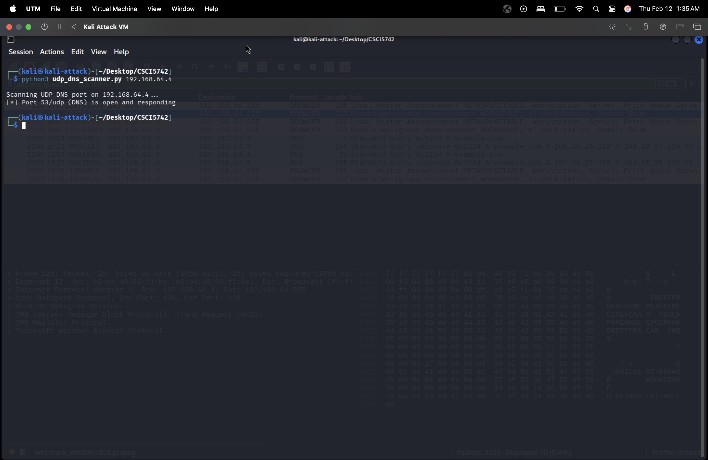

#### **Screenshot (DNS Responses/ICMP Errors)**: 
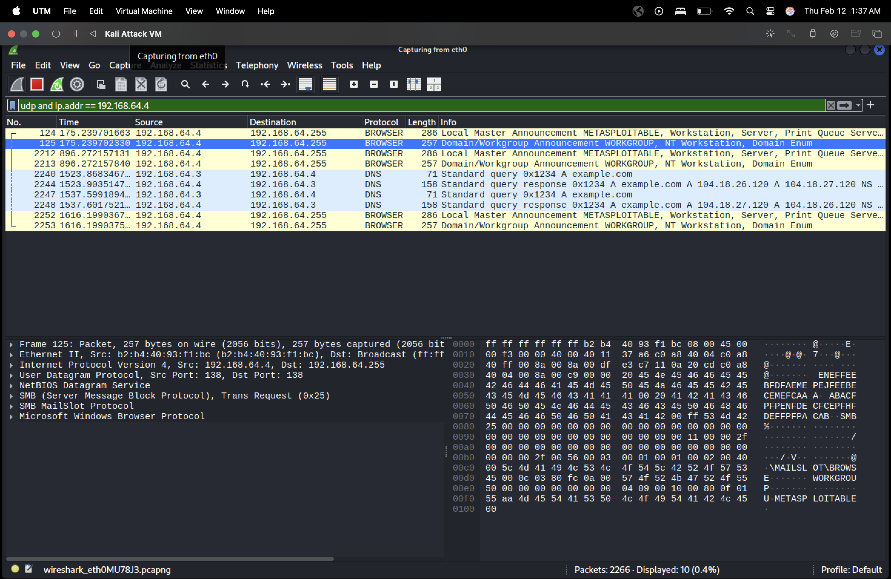

Analyze Responses:
**Identify DNS responses from the target.Note any cases where no response is received or where ICMP errors are returned.**
DNS query packets were sent to port 53 and the target replied with DNS response packets. This shows that UDP port 53 is open and responding.No ICMP “Port Unreachable” errors were seen. If the port were closed, Wireshark would show an ICMP error instead of a DNS response.

#### **Answers to Questions**:  

**What challenges do you observe in identifying open or closed UDP ports based on the captured traffic?**
UDP scanning is harder because there is no handshake like TCP. If the port is open, it may send a response, but sometimes it may not reply at all. If the port is closed, it usually sends an ICMP “Port Unreachable” message. If there is no response, it is difficult to know whether the port is open, filtered, or just ignoring the request. That makes UDP results harder to understand compared to TCP.

---
### **Task 4: Inspect HTTP Traffic**

#### **Screenshot 1 (POST capture)**:  
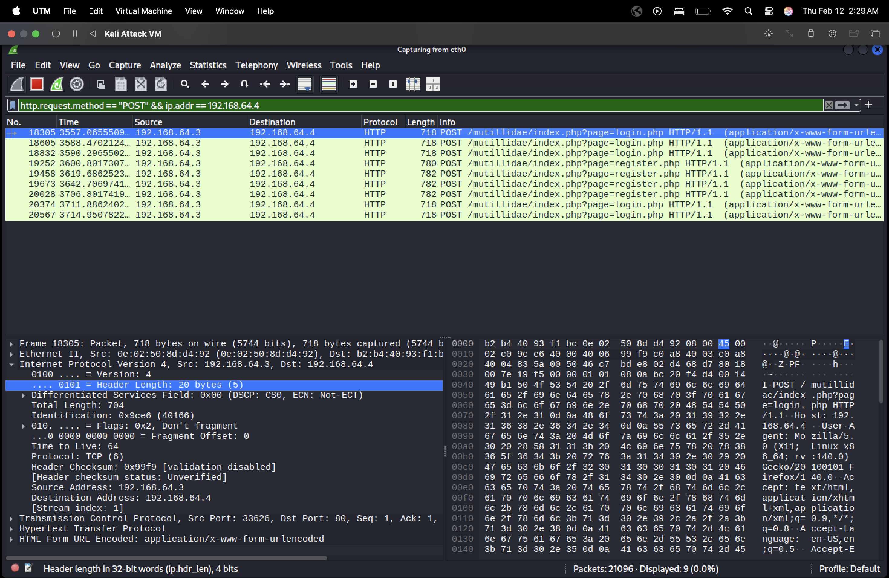

#### **Screenshot 2 (TCP Stream capture)**:
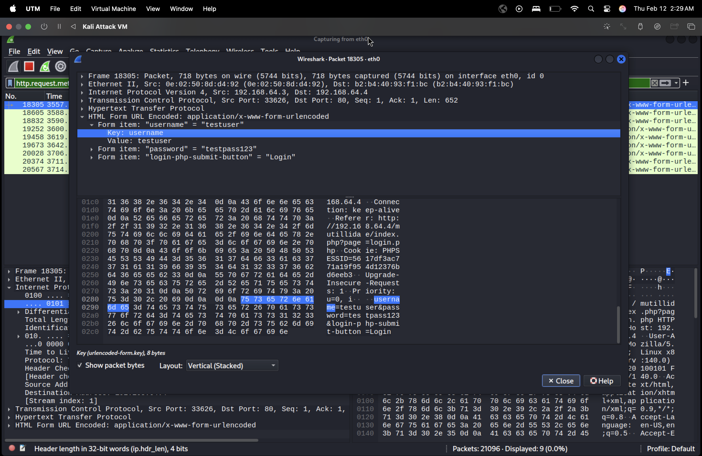

#### **Answers to Questions**:
**What exactly makes HTTP credentials visible to a passive sniffer?**
HTTP does not use encryption. When a login form is submitted, the username and password are sent in plain text inside the HTTP POST request. A passive sniffer like Wireshark can capture the packets and directly read the credentials from the packet data.

**What changes when the same login is performed over HTTPS?**
HTTPS uses TLS encryption. The data (including username and password) is encrypted before being sent over the network. Even if a sniffer captures the packets, the credentials cannot be read because they appear as encrypted data instead of plain text.

---

### **Part 3 Summary and Analysis**
Wireshark was used to analyze network traffic generated by different scans and activities. ICMP traffic confirmed successful communication between the Kali and Metasploitable-2 machines. During the SYN scan, open ports responded with SYN-ACK packets, while closed ports responded with RST packets. This showed how Nmap identifies port states without completing the full TCP handshake.
For UDP DNS scanning, DNS query and response packets were observed. Unlike TCP, UDP does not use a handshake, which makes it harder to determine port status when no response is received. Finally, HTTP traffic was inspected to capture login credentials. The username and password were visible in plain text inside the HTTP POST request, demonstrating the risk of unencrypted communication. This part highlights the importance of using HTTPS to protect sensitive information.

---

## **Part 4: Web Scanning with Nikto (Extra Credit)**

### **Task 1: Nikto Scan**

#### **Screenshot**:
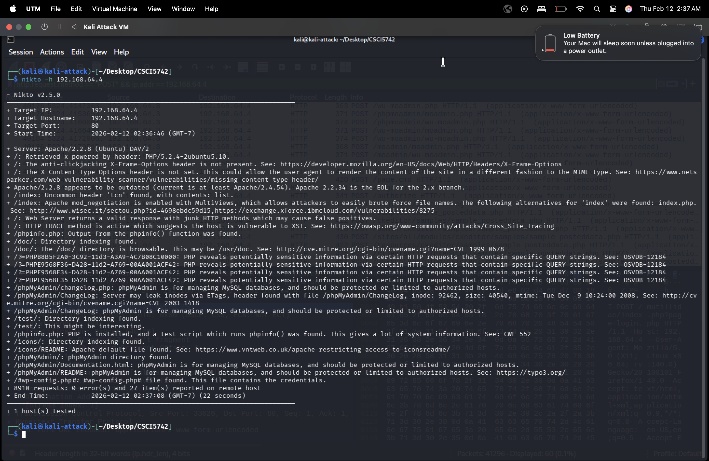

Reflect on the Results:
**What does the server information reveal about the target?**
The server information shows that the target is running Apache 2.2.8 on Ubuntu with an old PHP version. This means the system is outdated and may have known security vulnerabilities.

**Why might exposed directories be a concern?**
Exposed directories like /phpmyadmin/ or /mutillidae/ can give attackers access to sensitive applications. If they are not properly secured, attackers could access files, databases, or configuration information.

#### **Significance of Output**:

The Nikto scan shows that the target is running an outdated version of Apache and PHP. This is important because old software versions often have known security vulnerabilities that attackers can use to exploit the system. The scan also found exposed directories like `/phpmyadmin/` and `/mutillidae/`. These directories can give access to web applications or database management tools, which may contain sensitive information if not properly secured. Nikto also reported missing security headers and directory indexing enabled, which increases security risk. Overall, the results show that the web server is not properly secured and could be easily targeted if used in a real environment.

---

### **Task 2: Nikto vs. Nmap HTTP Scans**

#### **Screenshot (Nmap HTTP Script)**:
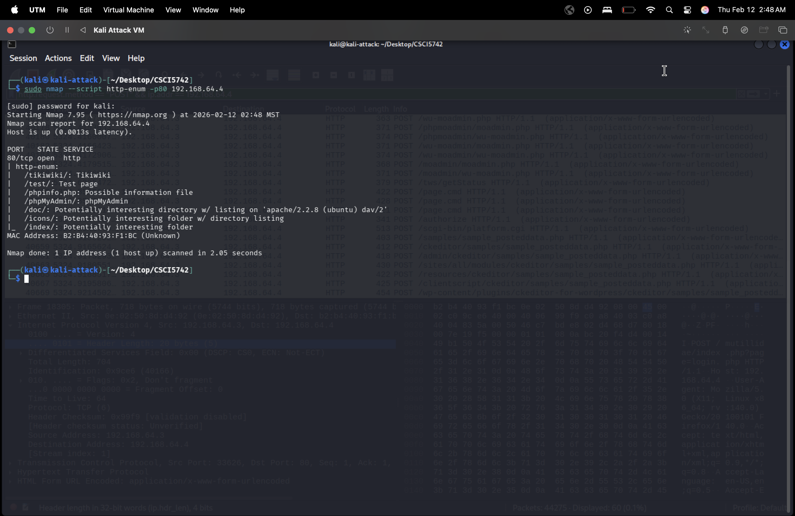

**Identify what additional information Nikto provides compared to Nmap.**
Nikto provides detailed security information like outdated server versions, missing security headers, exposed files (e.g., phpinfo.php), and configuration weaknesses.Nmap mainly lists directories and basic web content, while Nikto focuses more on security issues.

**Explain how these tools complement each other in reconnaissance.**
Nmap helps identify open ports and available web directories. Nikto analyzes the web server for vulnerabilities. Together, Nmap finds what is running, and Nikto finds what is insecure.

#### **Comparison Summary**:
Nmap and Nikto both help in web reconnaissance, but they focus on different things. Nmap with the `http-enum` script mainly identifies open ports and lists discovered directories such as `/phpmyadmin/`, `/test/`, and other accessible paths. It is fast and useful for service detection and basic web enumeration.
Nikto provides more detailed security information. It shows the web server version (Apache/2.2.8), detects outdated software, missing security headers, exposed files like `phpinfo.php`, and other configuration issues. This helps in identifying possible weaknesses in the web server.
In summary, Nmap is strong for discovering services and directories, while Nikto is better for finding security misconfigurations and potential vulnerabilities. Together, they give a clearer and more complete picture of the target system.

---

### **Part 4 Summary and Analysis**

Web scanning tools were used to analyze the HTTP service running on port 80 of the Metasploitable-2 machine. Nmap was used to identify open web directories and confirm that Apache was running. It helped in discovering accessible paths such as /phpmyadmin/ and other web folders.
Nikto was then used to perform a deeper web server analysis. It identified the server version, detected that it was outdated, and reported missing security headers and exposed files like phpinfo.php. These findings show that the web server has several security weaknesses.
Overall, this part demonstrated how different tools can be used together for web reconnaissance. Nmap provides service and directory discovery, while Nikto focuses more on identifying security misconfigurations and potential risks.

