## **Lab 3 Report**
##### CSCI 5742: Cybersecurity Programming and Analytics, Spring 2026

**Name & Student ID**: [Tejal Jadhav], [111530319]

## **Part 1: Developing a Network Sniffer with Python**

### **Task 1: Capturing Raw Packets**
**Goal:** Capture raw Ethernet frames using `PF_PACKET` + `SOCK_RAW`.

#### **Screenshot**:
*(Insert screenshot of terminal output showing raw bytes from `recvfrom()` while traffic is generated.)*
#### **Screenshot**:

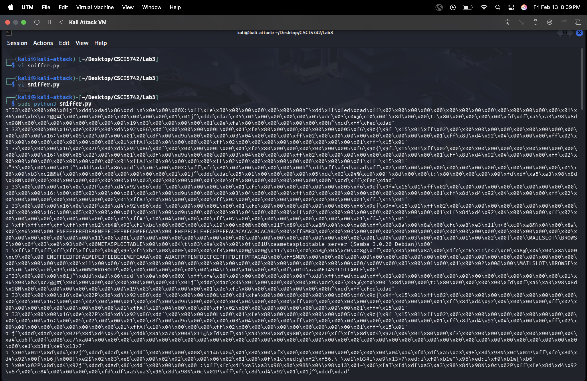
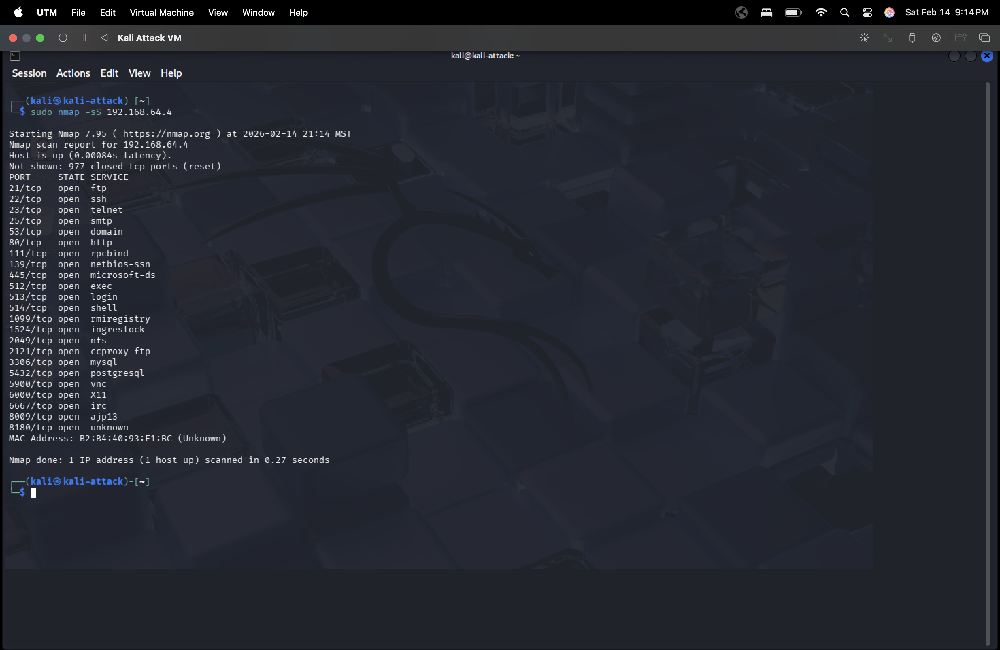

#### **Answer to Questions**:
- **Explain why we need `sudo` to run the program:**
  *We need sudo because the program is trying to capture raw network packets directly from the network card. In Linux, this kind of low-level access is only allowed for the root user for security reasons. If we run the program without sudo, it will not have permission to create a raw socket and it will fail. That’s why we must use sudo to give it the required privileges.*

---

### **Task 2: Dissecting Ethernet Frames**
**Goal:** Parse destination/source MAC addresses and EtherType from the Ethernet header.

#### **Screenshot**:
*(Insert screenshot showing parsed MAC addresses and EtherType, during active traffic.)*
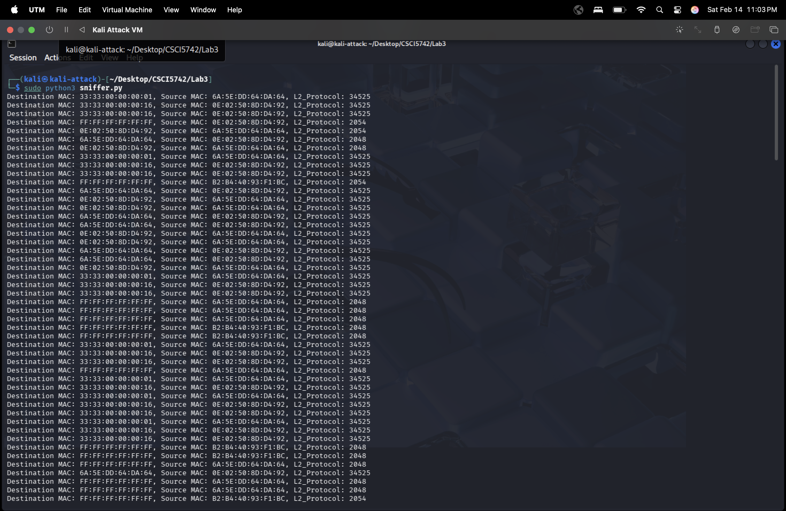
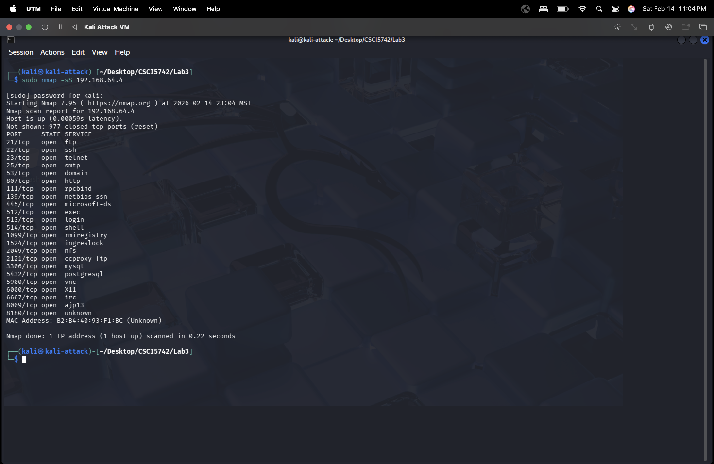

**Explanation of how MAC addresses and protocol types are extracted and formatted.**
The Ethernet header has 14 bytes. The first 6 bytes are the destination MAC address, the next 6 bytes are the source MAC address, and the last 2 bytes are the protocol type. We use struct.unpack('!6s6sH', ethernet_data[:14]) to extract these values.
The MAC addresses come as raw bytes, so we convert them into readable hexadecimal format and join them with colons. The protocol type is printed in hexadecimal so we can see values like 0x0800 for IPv4.

#### **Answer to Questions**:
1. **What does the `!6s6sH` format in `struct.unpack` signify?**  
   *The !6s6sH format tells Python how to read the Ethernet header. The ! means network byte order (big-endian). The first 6s reads 6 bytes for the destination MAC address, the second 6s reads 6 bytes for the source MAC address, and H reads 2 bytes for the protocol type (EtherType).*  

**(Optional but recommended: briefly explain how you formatted MAC addresses.)**
The MAC addresses are first extracted as raw bytes. To make them readable, each byte is converted into a two-digit hexadecimal value and joined together with colons. This gives the standard MAC address format like AA:BB:CC:DD:EE:FF.

---

### **Task 3: Decoding IPv4 Headers**
**Goal:** Parse IPv4 header fields (source/destination IP, protocol, header length/IHL).

#### **Screenshot**:
*(Insert screenshot showing parsed IPv4 fields during Nmap/ping traffic.)*
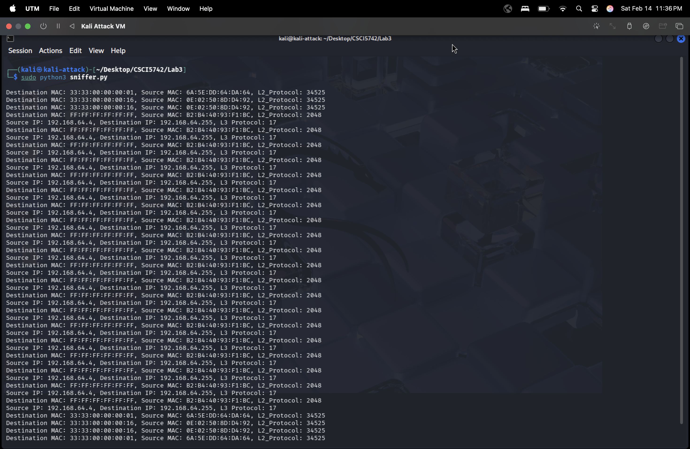
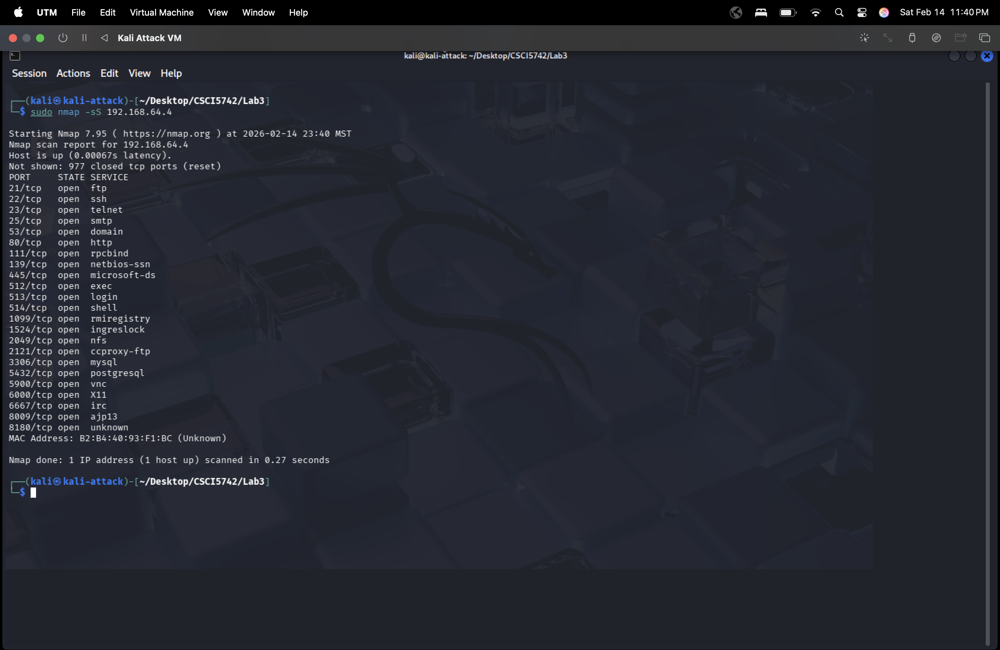

**Explanation of how IP addresses and protocol types are extracted.**
We unpack the first 20 bytes of the IPv4 header using struct.unpack. This gives us different fields, including the source IP, destination IP, and protocol number. The IP addresses come as 4-byte values, so we use socket.inet_ntoa() to convert them into normal dotted format like 192.168.64.4.
The protocol field tells us what type of packet it is next, like TCP (6), UDP (17), or ICMP (1).

#### **Answer to Questions**:
1. **What does the `!BBHHHBBH4s4s` format in `struct.unpack` represent?**  
   *The ! means the data is in network byte order. The letters like B, H, and 4s tell Python how many bytes to read for each field in the IPv4 header. For example, B reads 1 byte, H reads 2 bytes, and 4s reads 4 bytes. This format matches the structure of the IPv4 header, including things like version, protocol, and the source and destination IP addresses.*  
2. **What does the `0x0800` value signify in Ethernet protocol?**  
   *0x0800 is the EtherType value for IPv4. It tells us that the data inside the Ethernet frame is an IPv4 packet.*

---

### **Task 4: Parsing Transport Layers (TCP/UDP)**
**Goal:** Parse TCP and UDP headers, print ports, and for TCP print header length + flags.

#### **Screenshot**:
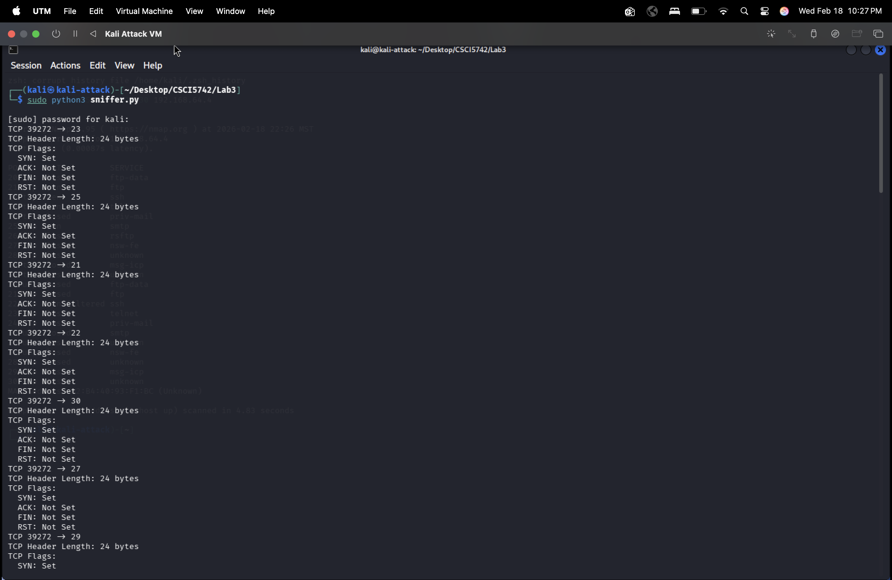
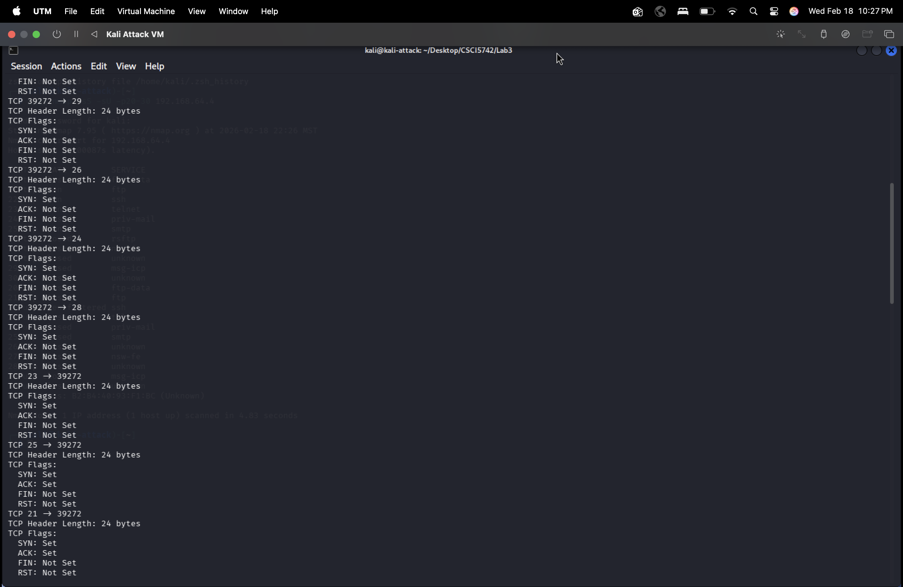
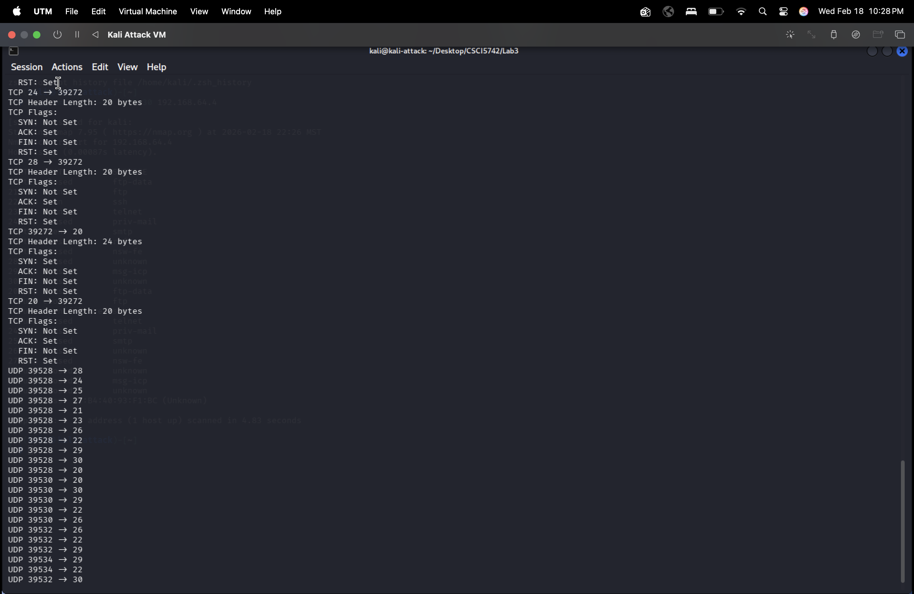

**Explanation of TCP flags and header length calculation.**
TCP flags like SYN, ACK, FIN, and RST show what stage the connection is in. For example, SYN is used to start a connection, ACK is used to confirm that data was received, FIN is used to close the connection, and RST resets it. By checking these flags, we can understand what is happening in the TCP communication.

The TCP header length comes from the Data Offset field. This value tells us how long the TCP header is. It is stored in 32-bit words, so we shift it to get the correct value and then multiply by 4 to convert it into bytes.

#### **Answer to Questions**:
1. **How is the TCP header length calculated from the offset field?**  
   The header length is stored in the top 4 bits of the offset field. We shift it to the right to extract those bits, and then multiply by 4 because the value is given in 32-bit words. This gives us the header length in bytes.

2. **Why is the UDP header simpler than TCP?**  
   UDP is simpler because it does not establish a connection or track data like TCP does. It only includes basic information like source port, destination port, length, and checksum. It doesn’t need flags or sequence numbers, so its header is much smaller.

3. **What are the differences between TCP and UDP in terms of packet structure and reliability?**  
   TCP has a bigger header and includes extra fields like sequence numbers and flags. It is reliable because it makes sure data is delivered correctly and in order. UDP has a smaller header and does not guarantee delivery or order. It is faster but less reliable compared to TCP.

---

### **Task 5: Dissecting ICMP Packets**
**Goal:** Parse ICMP type, code, checksum and show output during ping traffic.

#### **Screenshot**:
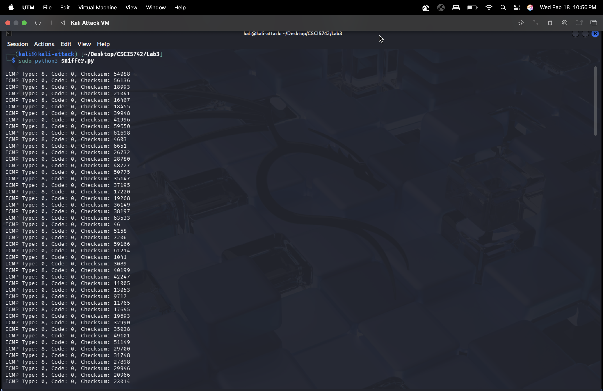

#### **Answer to Questions**:
1. **What are common types of ICMP messages, and how are they used?**  
   The most common ICMP types are:
   - Type 0 (Echo Reply) – the reply sent back to the system that sent the ping.
   - Type 3 (Destination Unreachable) – sent when a host or network cannot be reached.
   - Type 8 (Echo Request) – used by ping to check if a system is reachable.
   - Type 11 (Time Exceeded) – used when TTL becomes 0 (like in traceroute).

2. **Why is the checksum field critical in ICMP packets?**  
   The checksum makes sure the ICMP packet was not corrupted while traveling across the network.
   If something changes in the packet during transmission, the checksum won’t match and the packet will be dropped. So it helps maintain data integrity. 

3. **How can analyzing ICMP traffic help in network diagnostics and security?**  
   By analyzing ICMP traffic, we can check if devices are online, detect routing problems, see if a host is unreachable, detect suspicious activity like ping sweeps or ICMP flooding. So ICMP is helpful for both troubleshooting and security monitoring.

---

### **Task 6: Parsing HTTP Packets**
**Goal:** Identify HTTP traffic (port 80), decode and print a portion of the payload.

#### **Screenshot**:
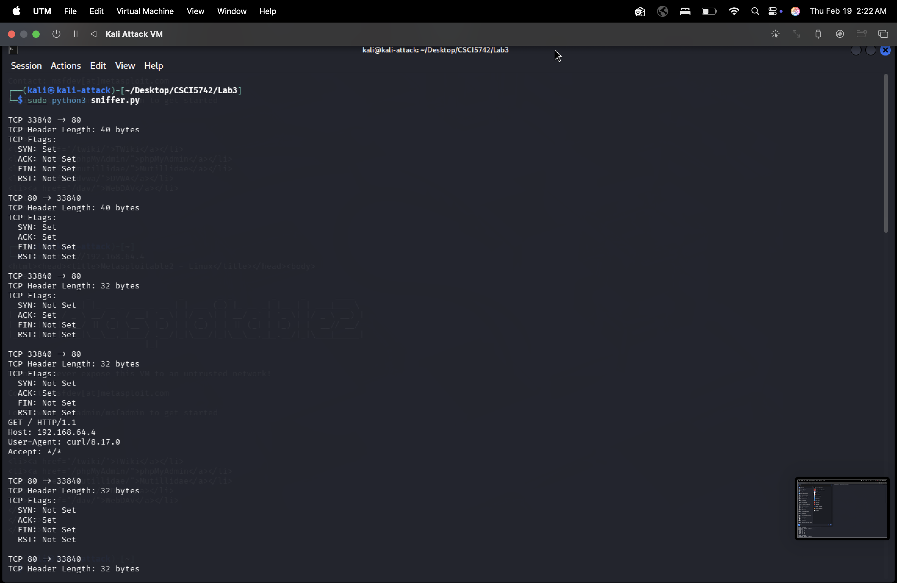
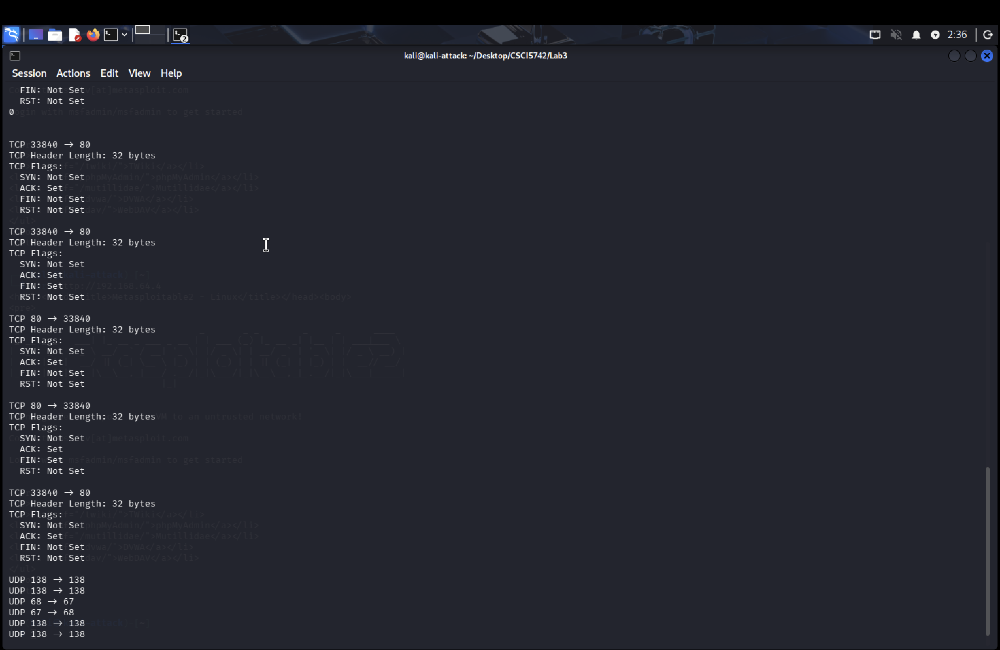

#### **Answer to Questions**:
1. **What does the decoded payload reveal about the HTTP request/response structure?**  
   From the decoded payload, I can see that HTTP is actually just plain text and follows a proper format. For example, I captured something like:
   GET / HTTP/1.1
   Host: 192.168.64.4
   User-Agent: curl/8.17.0
   Accept: */*

   The first line shows the method, the path, and the HTTP version. After that, there are headers like Host and User-Agent which give extra details about the request. If it’s a response, it usually starts with something like: HTTP/1.1 200 OK
   So basically, HTTP messages have a first line (request line or status line), some headers, then the actual content (like HTML), seeing this in the payload confirms that HTTP data is readable and structured.

2. **Identify any HTTP request methods or response status codes captured. What do they indicate?**  
   GET: This means the client is requesting a webpage from the server. 
   If we see something like 200 OK: that means the request was successful and the server responded properly.
   Other common ones (even if not captured) are:
   - 404 → Page not found
   - 500 → Server error
   So overall, the method tells what the client is asking for, and the status code tells whether it worked or not.

---

### **Task 7: Parsing DNS Packets (Header Only)**
**Goal:** Parse DNS header fields (transaction ID, flags, counts) from UDP/53 traffic.

#### **Screenshot**:
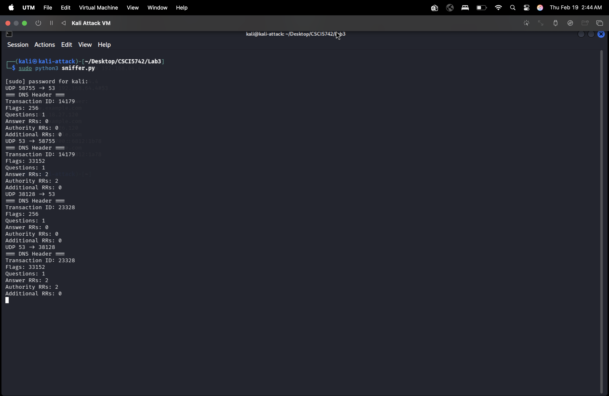

#### **Answer to Questions**:
1. **How does the transaction ID help match DNS queries to responses?**  
   The transaction ID is like a tracking number. When a client sends a DNS query, it adds a transaction ID to it. The DNS server sends the reply back with the same ID. So when the client receives the response, it checks the transaction ID and knows which request that response belongs to. This is important when many DNS requests are happening at the same time.

2. **What do DNS flags broadly indicate about a message?**  
   The DNS flags tell us extra information about the message. They show, whether the message is a query or a response, if recursion is requested, if recursion is available, if the answer is authoritative, if there was any error.So basically, the flags describe what kind of DNS message it is and how it should be handled.

3. **Why might DNS use TCP instead of UDP in some cases?**  
   DNS usually uses UDP because it is faster and lightweight. But it uses TCP when the response is too big, the UDP message gets truncated, during zone transfers between DNS servers, TCP is more reliable and can handle larger data, but it is slower compared to UDP.

---

### **Part 1 Summary and Analysis**
I implemented and tested a packet sniffer to analyze different types of network traffic. While running the sniffer, I observed clear patterns for each protocol. When using ping, I captured ICMP packets with Type 8 (Echo Request) and Type 0 (Echo Reply), which showed how devices check connectivity. When using curl, I observed TCP traffic on port 80 along with the HTTP GET request in plain text. For DNS queries using nslookup and dig, I captured UDP traffic on port 53 and saw matching transaction IDs between the query and response packets. The response packets also showed answer record counts greater than zero, confirming successful DNS resolution.

A key learning point from this lab was understanding how different network layers work together. I was able to see how Ethernet frames contain IP packets, and how IP packets carry TCP, UDP, or ICMP data. I also understood how application layer protocols like HTTP and DNS operate on top of transport protocols. Seeing real packet data instead of just theoretical diagrams helped me better understand how network communication actually works.

Overall, this lab gave me practical experience in analyzing live network traffic and understanding how different protocols interact with each other.

---

## **Part 2: Sniffing with Scapy**

### **Task 1: Capturing Packets with Scapy (TCP-only warmup)**
**Goal:** Use Scapy to sniff TCP traffic and print MAC/IP/port information.

#### **Screenshot**:
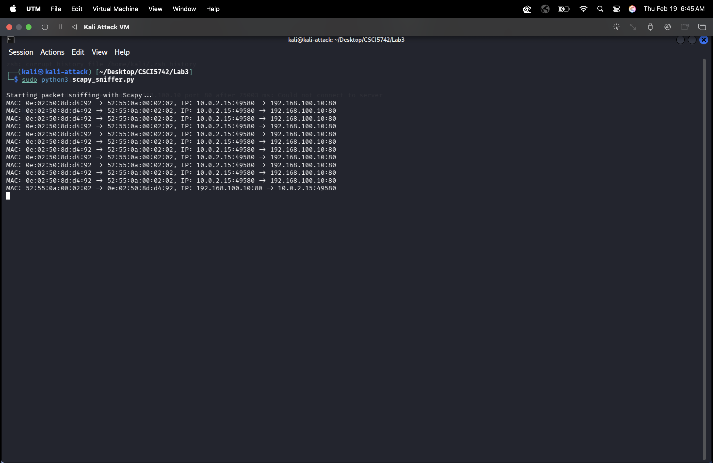
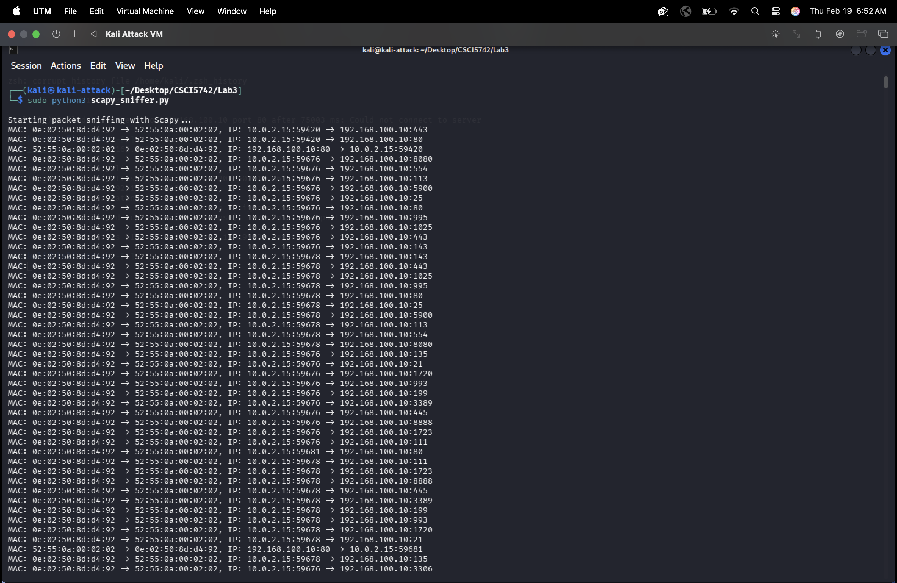

#### **Answer to Questions**:
The Scapy sniffer successfully captured TCP traffic generated using both curl and Nmap SYN scans. The output displayed correct source and destination MAC addresses, source and destination IP addresses, and TCP port numbers. During HTTP traffic generation, packets were observed from a random high-numbered client port to destination port 80. During the Nmap SYN scan, multiple destination ports (e.g., 21, 25, 80, 443, 3306) were observed, confirming proper TCP scan traffic capture. Bidirectional communication was also captured, verifying correct packet sniffing functionality.

---

### **Task 2: Parsing Ethernet and IP Layers**
**Goal:** Extract Ethernet and IP fields using Scapy layers and print them.

#### **Screenshot**:
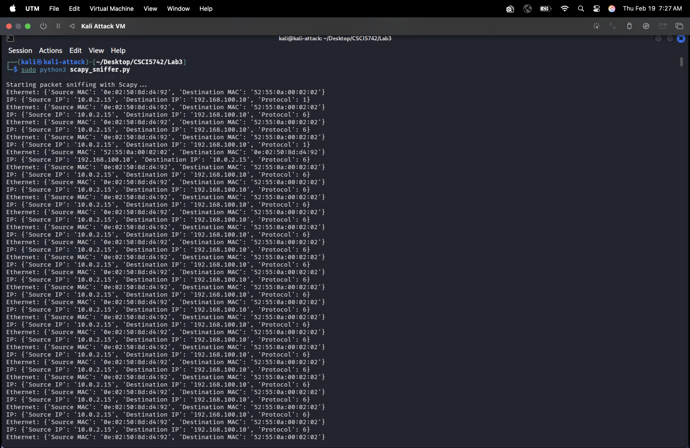

#### **Answer to Questions**:
1. **How does Scapy simplify the extraction of Ethernet and IP layer fields?**  
   Scapy simplifies the extraction of Ethernet and IP layer fields because it automatically breaks down packets into readable layers. Instead of manually decoding raw hexadecimal data, we can directly access fields using simple syntax like packet[Ether].src for the source MAC address or packet[IP].dst for the destination IP address. Scapy already understands how Ethernet and IP headers are structured, so it organizes everything for us in a clean and structured way. This makes packet analysis much easier and more efficient, especially compared to manually parsing packet bytes.

2. **What is the `packet[IP].proto` field, and how does it relate to TCP/UDP?**  
   The packet[IP].proto field represents the protocol number in the IP header, which tells us what transport layer protocol is being used. For example, a value of 6 means the packet is using TCP, and a value of 17 means it is using UDP. So when we see Protocol: 6 in the output, it confirms that the captured traffic is TCP traffic, such as from Nmap scans or HTTP requests using curl. This field basically connects the IP layer to the next protocol layer and helps us understand what type of communication is happening.

---

### **Task 3: Parsing Transport Layers (TCP/UDP)**
**Goal:** Parse TCP flags + ports and UDP ports + length.

#### **Screenshot**:
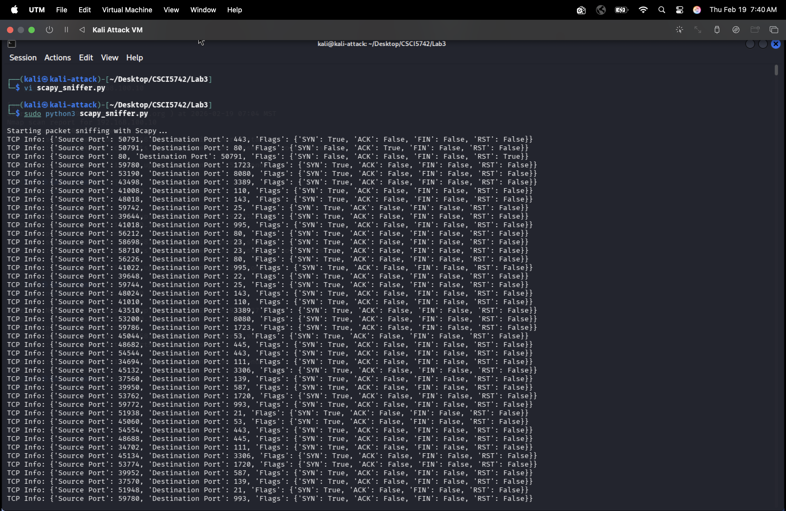
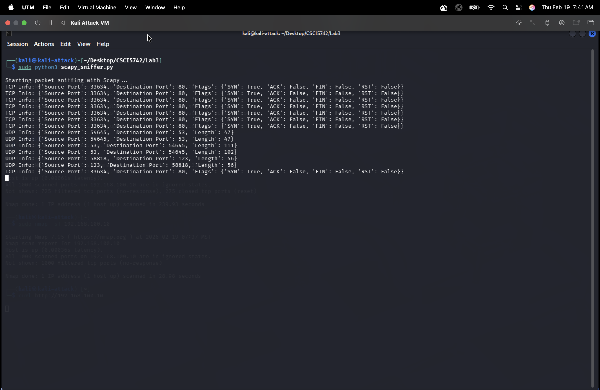
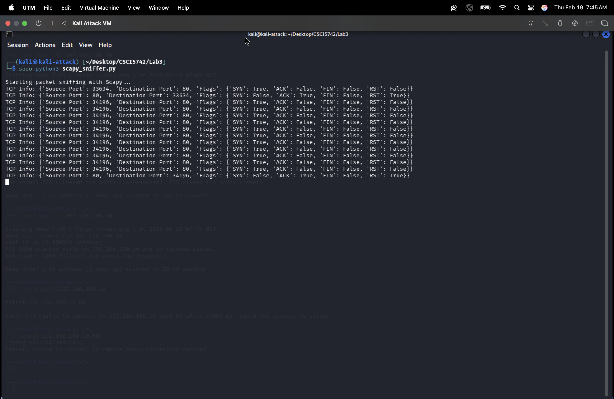

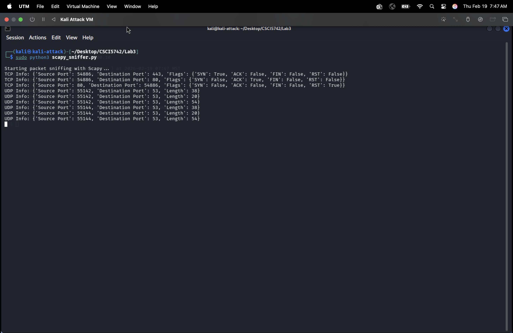
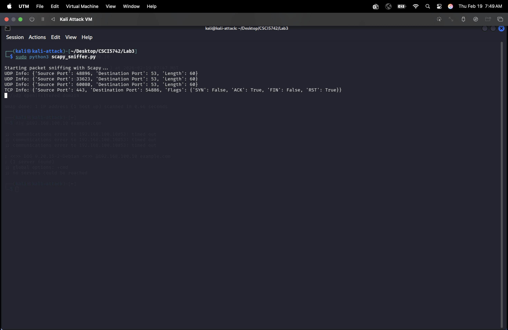

#### **Answer to Questions**:
1. **How do TCP flags help in identifying packet behavior?**  
   TCP flags help us understand what stage the TCP connection is in. For example, the SYN flag is used to start a connection, ACK is used to acknowledge received data, FIN is used to close a connection, and RST resets a connection. By checking which flags are set, we can identify whether a packet is trying to establish a connection, respond to one, close it, or reset it. This helps us analyze how communication is happening between devices.

2. **Why is the length field in UDP important, and how does it differ from TCP’s behavior?**  
   The length field in UDP tells us the total size of the UDP packet, including header and payload. Since UDP does not have sequencing or acknowledgment mechanisms like TCP, it relies on this length field to know how much data is being sent. TCP does not use a simple length field in the same way because it manages data using sequence numbers and stream-based communication. TCP is more complex and tracks data reliability, while UDP is simpler and faster.

3. **What are the primary differences between TCP and UDP in terms of reliability and usage?**  
   TCP is connection-oriented and reliable. It ensures data is delivered in order and retransmits lost packets. It is commonly used for web browsing (HTTP/HTTPS), file transfers, and email. UDP is connectionless and does not guarantee delivery. It is faster and has less overhead, which makes it suitable for streaming, DNS queries, and online gaming where speed is more important than reliability.

4. **Explain the logic behind `'ACK': flags & 0x10 != 0` (or similar) for testing whether a flag is set.**  
  The expression flags & 0x10 != 0 checks whether the ACK bit is set in the TCP flags field. Each TCP flag has a specific bit value. The value 0x10 represents the ACK flag. The & operator performs a bitwise AND operation. If the result is not zero, it means that bit is set, so ACK is true. If the result is zero, it means the ACK flag is not set.

---

### **Task 4: Parsing ICMP Packets**
**Goal:** Parse ICMP type/code/checksum using Scapy.

#### **Screenshot**:
## Task 4 – ICMP Output

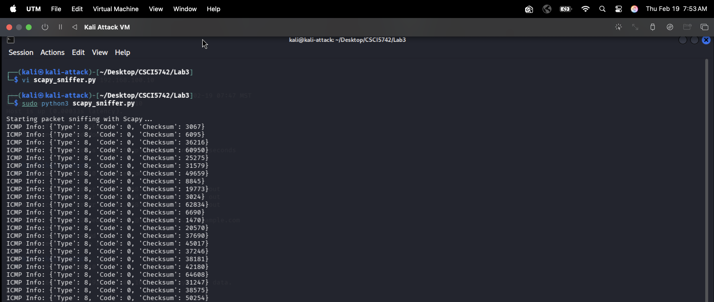

#### **Answer to Questions**:
1. **What is the purpose of ICMP packets in networking?**  
   ICMP is mainly used for error reporting and network diagnostics. It does not carry actual application data like TCP or UDP. Instead, it helps devices communicate network-related information, such as whether a host is reachable or if there is a routing issue. For example, when we use the ping command, it sends ICMP Echo Request packets and receives Echo Reply packets. This helps us check if another machine is alive and reachable on the network.  
2. **How are ICMP type and code fields used to differentiate packet types?**  
   The ICMP Type field identifies the main category of the message, while the Code field gives more specific details about that type. For example, Type 8 means Echo Request (ping request) and Type 0 means Echo Reply. Other types represent errors like “Destination Unreachable.” The Code field further explains the reason, such as whether the network is unreachable or the port is unreachable. So basically, the Type tells us what kind of ICMP message it is, and the Code gives extra information about it.

3. **What role does the checksum play in ICMP packets?**  
   The checksum is used for error detection. It ensures that the ICMP packet was not corrupted during transmission. When a packet is sent, the checksum is calculated based on the packet data. When it reaches the destination, the receiving device recalculates the checksum and compares it with the original one. If they don’t match, it means the packet was damaged or modified during transmission, and it may be discarded. So the checksum helps maintain data integrity in ICMP communication.

---

### **Task 5: Parsing HTTP Packets**
**Goal:** Extract and print HTTP payload (port 80) from TCP packets.

#### **Screenshot**:
## Task 5 – HTTP Packet Parsing

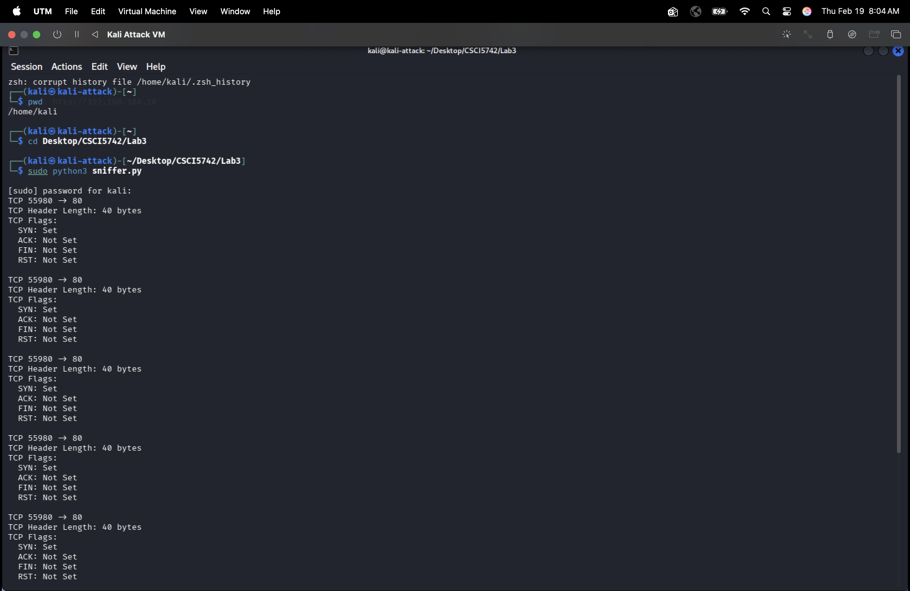

#### **Answer to Questions**:
1. **Why does HTTP operate on port 80 by default?**  
   HTTP operates on port 80 by default because it is the standard port assigned by IANA for web traffic. When a browser sends a request to a website without specifying a port number, it automatically connects to port 80 for HTTP. This standardization allows web servers and clients to communicate consistently without needing to manually specify the port each time.
2. **What common HTTP methods (e.g., GET, POST) did you identify?**  
   In the parsed payload, we can identify common HTTP methods such as GET and sometimes POST. When using curl, we usually see a GET request, which is used to request data from a web server. The response from the server often starts with something like HTTP/1.1 200 OK, which indicates that the request was successful.

3. **What challenges might arise when decoding HTTP data in raw packet captures?**  
   One challenge when decoding HTTP data is that not all payloads are plain text. Some responses may contain binary data such as images or compressed content, which can cause decoding errors. Also, if the traffic is HTTPS instead of HTTP, the data will be encrypted and cannot be read directly. Another issue is that TCP segments may split HTTP messages across multiple packets, making it harder to reconstruct the full message from a single packet.

---

### **Task 6: Parsing DNS Packets**
**Goal:** Extract DNS fields (transaction ID, question/answer counts) using Scapy’s DNS layer.

#### **Screenshot**:
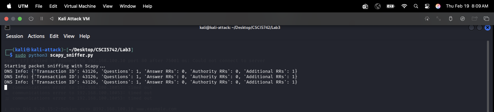

#### **Answer to Questions**:
1. **What is the significance of the transaction ID in DNS packets?**  
   The transaction ID in a DNS packet is used to match a DNS response to its corresponding query. When a client sends a DNS request, it assigns a unique transaction ID. When the DNS server sends the reply, it includes the same transaction ID. This helps the client verify that the response matches the original request, especially when multiple DNS queries are being sent at the same time.

2. **How do the flags in a DNS packet indicate query vs response?**  
   The flags field in a DNS packet contains several bits that describe the type of message. One important flag is the QR (Query/Response) bit. If QR is 0, the packet is a query. If QR is 1, it is a response. Other flags indicate whether recursion is desired, whether recursion is available, and whether the response is authoritative. These flags help identify whether the packet is a standard query or a response and provide additional status information.

3. **Why does DNS primarily use UDP instead of TCP, and when might it use TCP?**  
   DNS primarily uses UDP because it is faster and has lower overhead compared to TCP. Most DNS queries and responses are small, so they can fit within a single UDP packet, making communication quicker. However, DNS uses TCP when the response size is too large for UDP (for example, when the response is truncated) or during zone transfers between DNS servers. TCP is also used when reliability is required for larger data transfers.

---

### **Part 2 Summary and Analysis**
*(Write 200–300 words covering: traffic patterns observed, key learning points, challenges resolved, and a comparison of Scapy vs raw sockets—abstraction, ease, flexibility, and limitations.)*

Different types of network traffic were captured and analyzed using Scapy, including TCP, UDP, ICMP, HTTP, and DNS packets. By generating traffic with tools like nmap, curl, ping, and dig, it became clear how each protocol behaves differently on the network. For example, TCP traffic showed SYN packets during connection attempts and ACK packets in responses, which helped in understanding how the TCP handshake works. UDP traffic, especially DNS, did not show any connection setup because UDP is connectionless. ICMP packets appeared when using ping, showing echo requests and replies. HTTP packets displayed readable GET requests, making it easier to see how web communication happens.

A key learning point was understanding how protocol fields and flags indicate packet behavior. TCP flags helped identify connection states, and DNS fields like transaction ID and record counts showed how queries and responses are structured.

When comparing Scapy to raw sockets, Scapy was much easier to use. Raw sockets required manually unpacking bytes and interpreting headers, which was more complex and low-level. Scapy provides built-in protocol layers and direct access to fields like source IP, ports, and flags, making the code simpler and more readable. However, raw sockets give a deeper understanding of how packet data is structured at a lower level. Overall, Scapy offers better abstraction and ease of use, while raw sockets provide more detailed control and learning depth.
