# **Lab 4 Report**
##### CSCI 5742: Cybersecurity Programming and Analytics, Spring 2026

**Name & Student ID**: [Tejal Jadhav], [111530319]

---

# **Part 1: Reconnaissance & Scanning (10 pts)**

### **Task 1: Host Discovery**
#### **Screenshot:**
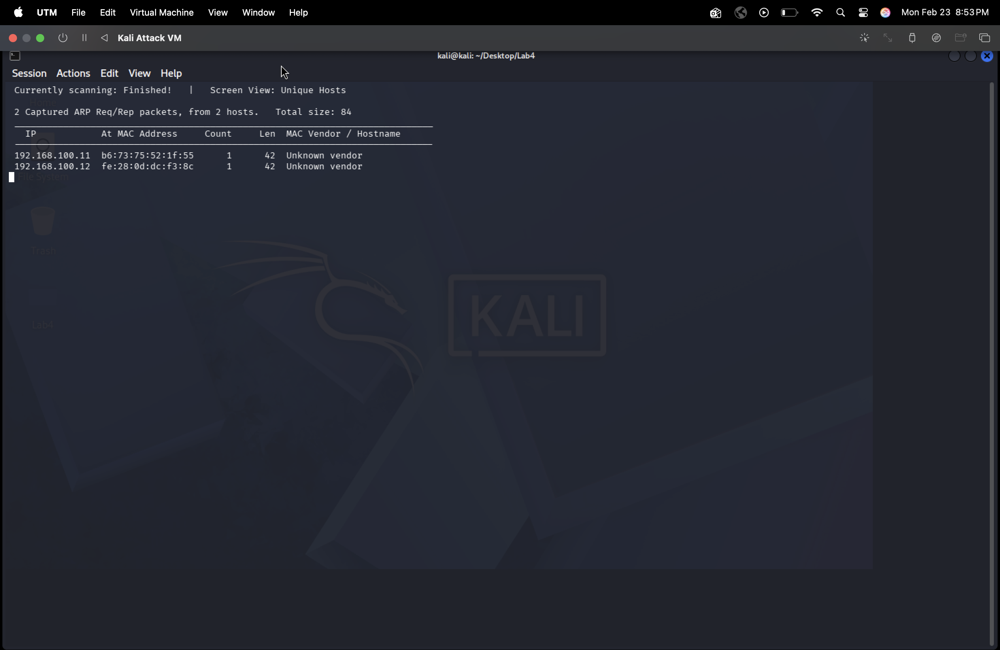

#### **Answers to Questions:**
1️⃣ What does `netdiscover` do, and what protocol does it use?  
netdiscover is used to identify active devices on a local network. It scans the given subnet and shows which IP addresses are currently online. It works by sending ARP requests and listening for replies from devices on the network. It uses the ARP to discover these active hosts.

2️⃣ What is the IP address of Metasploitable-2 (M2) in your network?  
The IP address of Metasploitable-2 in my network is:
192.168.100.12

---

### **Task 2: Service Discovery (Nmap Scan)**
#### **Screenshot:**
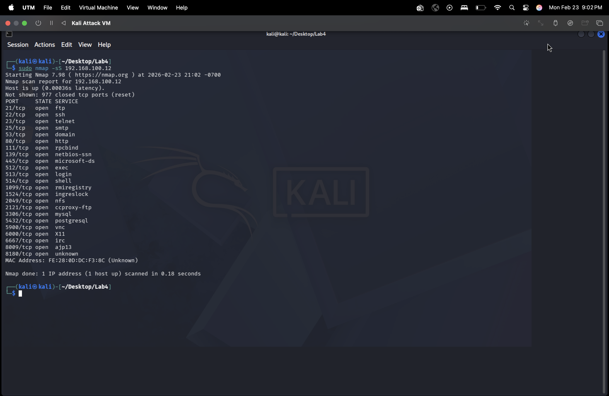

#### **Answers to Questions:**
3️⃣ Based on your scan results, list all open ports on M2.  
The following ports were open on Metasploitable-2:
| Port     | State | Service        |
|----------|-------|---------------|
| 21/tcp   | open  | ftp           |
| 22/tcp   | open  | ssh           |
| 23/tcp   | open  | telnet        |
| 25/tcp   | open  | smtp          |
| 53/tcp   | open  | domain (DNS)  |
| 80/tcp   | open  | http          |
| 111/tcp  | open  | rpcbind       |
| 139/tcp  | open  | netbios-ssn   |
| 445/tcp  | open  | microsoft-ds  |
| 512/tcp  | open  | exec          |
| 513/tcp  | open  | login         |
| 514/tcp  | open  | shell         |
| 1099/tcp | open  | rmiregistry   |
| 1524/tcp | open  | ingreslock    |
| 2049/tcp | open  | nfs           |
| 2121/tcp | open  | ccproxy-ftp   |
| 3306/tcp | open  | mysql         |
| 5432/tcp | open  | postgresql    |
| 5900/tcp | open  | vnc           |
| 6000/tcp | open  | X11           |
| 6667/tcp | open  | irc           |
| 8009/tcp | open  | ajp13         |
| 8180/tcp | open  | unknown       |

4️⃣ What is the most dangerous open service on the target? Justify your answer.  
The most dangerous open service is Telnet (port 23) because it is not secure. Telnet sends usernames and passwords in plain text, which means an attacker can easily capture the login credentials.

Since it allows remote access without encryption, it creates a serious security risk on the system.

---

### **Task 3: Detailed Service Version Discovery**
#### **Screenshot:**
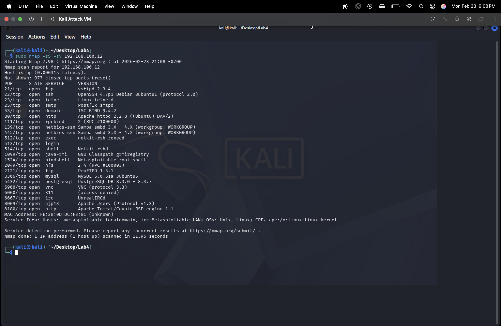

#### **Answers to Questions:**
5️⃣ What version of FTP is running on M2?  
The version of FTP running on Metasploitable-2 is vsftpd 2.3.4

6️⃣ Why is version detection important in penetration testing?  
Version detection is important because different versions of software may have known vulnerabilities. By identifying the exact version, we can check if there are any public exploits available for that specific service. This helps in finding possible security weaknesses more accurately during penetration testing.

---

### **Task 4: Understanding Common Services**
#### **Answers to Questions:**
7️⃣ Explain the difference between FTP, SSH, and Telnet in your own words.  
FTP, SSH, and Telnet are all network services, but they are used for different purposes.
- FTP is mainly used to transfer files between computers over a network. It allows users to upload and download files, but it usually does not encrypt the data.
- SSH is used to securely access and control a remote system. It encrypts the connection, which makes it safe for logging in and running commands remotely.
- Telnet is also used for remote access like SSH, but it does not encrypt the communication. This makes it less secure compared to SSH.

8️⃣ Why is Telnet considered insecure compared to SSH?  
Telnet is considered insecure because it sends all data, including usernames and passwords, in plain text. This means anyone who intercepts the network traffic can easily read the information.
SSH is more secure because it encrypts the entire connection. This protects login credentials and other data from being captured or viewed by attackers.

---

### **Task 5: Checking for Default or Weak Credentials**
#### **Screenshots:**
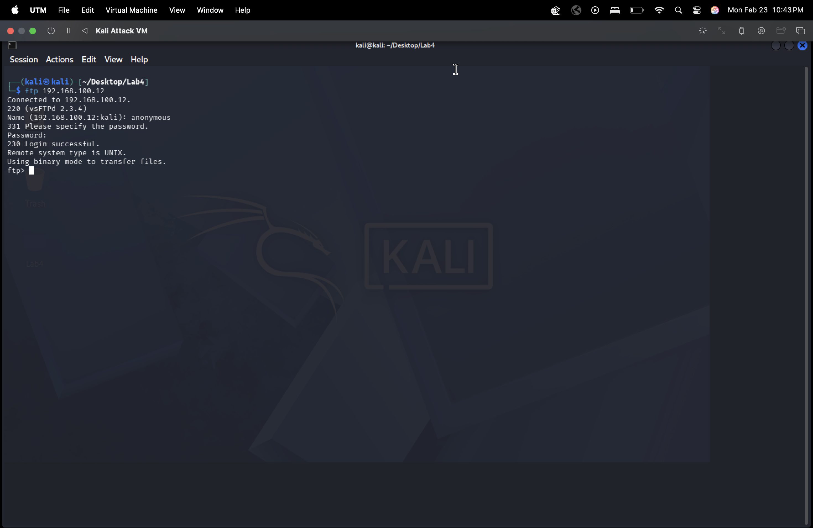 
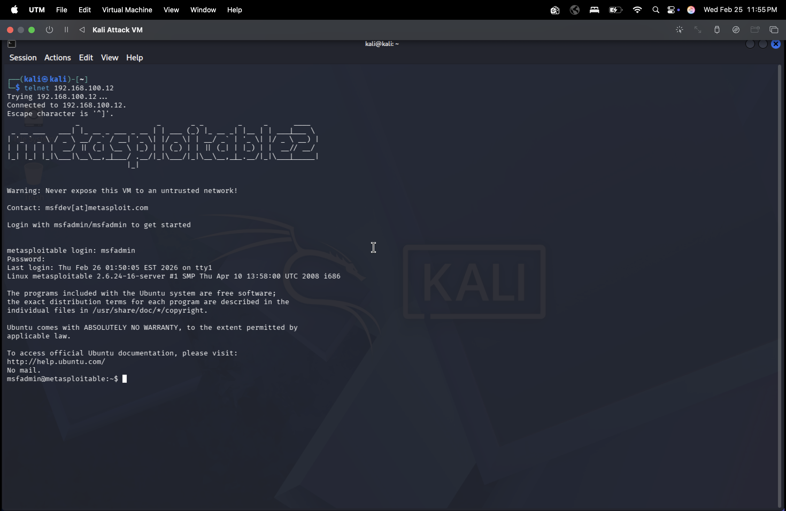 

#### **Answers to Questions:**
9️⃣ Were you able to log in anonymously to FTP? What files are visible?  
Yes, I was able to log in to the FTP service using the username `anonymous` without a password. The login was successful, which means anonymous access is enabled on the server. After running the `ls` command, no files were listed in the directory. Although no files were visible, allowing anonymous login is still a security weakness.

🔟 Were you able to log into Telnet? Why is this a security risk?  
Yes, I was able to log into the Telnet service using the default credentials (msfadmin/msfadmin). The login was successful and I gained shell access to the system.
This is a security risk because Telnet sends usernames and passwords in plain text over the network. Anyone monitoring the network traffic can capture these credentials. Additionally, using default credentials makes it very easy for attackers to gain unauthorized access.

---

### **Task 6: Search for Exploits (Pre-Exploitation)**
#### **Screenshots:**
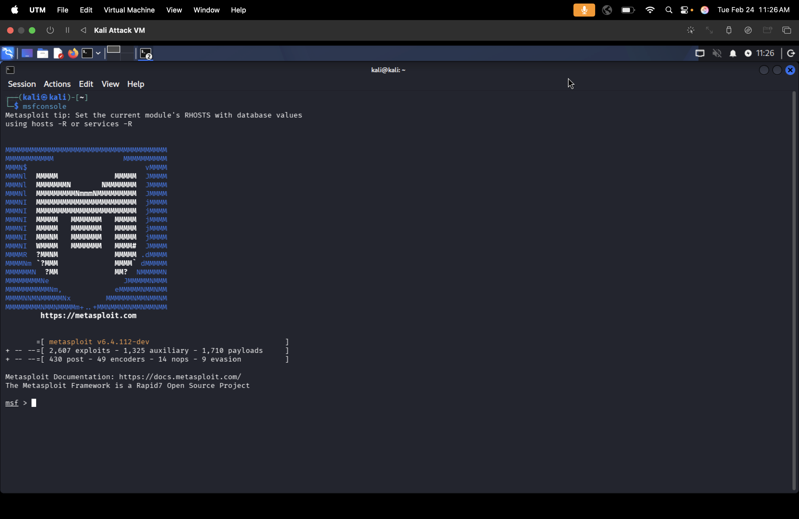
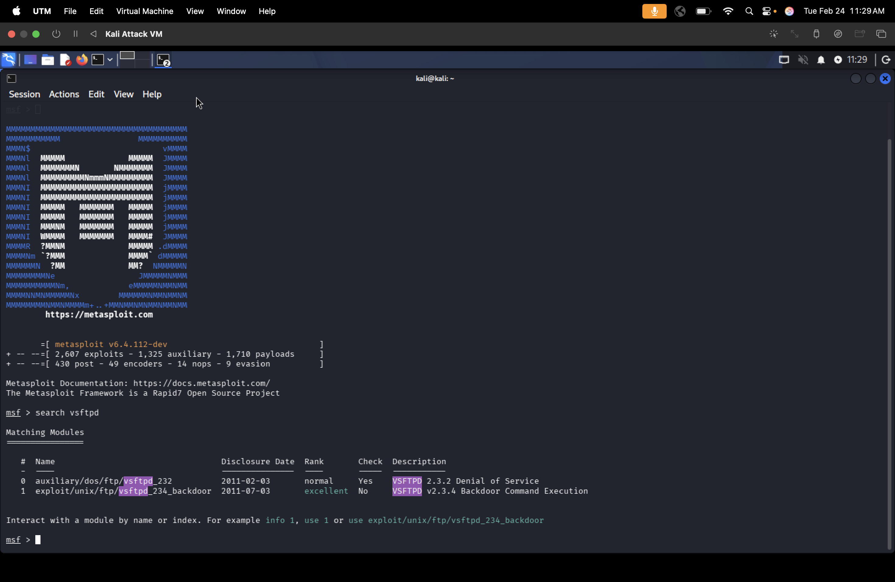
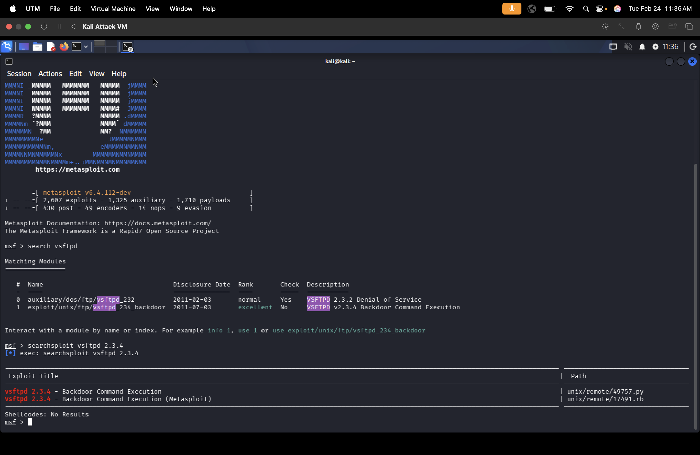

#### **Answers to Questions:**
1️⃣1️⃣ How many exploits are available for vsftpd 2.3.4?  
Metasploit shows one main exploit targeting version 2.3.4.
Searchsploit shows two exploit entries related to vsftpd 2.3.4.
So, there are two exploit entries available for vsftpd 2.3.4

1️⃣2️⃣ How can a system administrator protect against such exploits?  
A system administrator can prevent this by updating the FTP server to a newer, secure version. Regular patching, disabling unnecessary services, and restricting access using a firewall can also help reduce the risk.

---

# **Part 2: Exploiting VSFTPD 2.3.4 (20 pts)**

### **Task 1: Identify the VSFTPD 2.3.4 Service**
#### **Screenshot:**
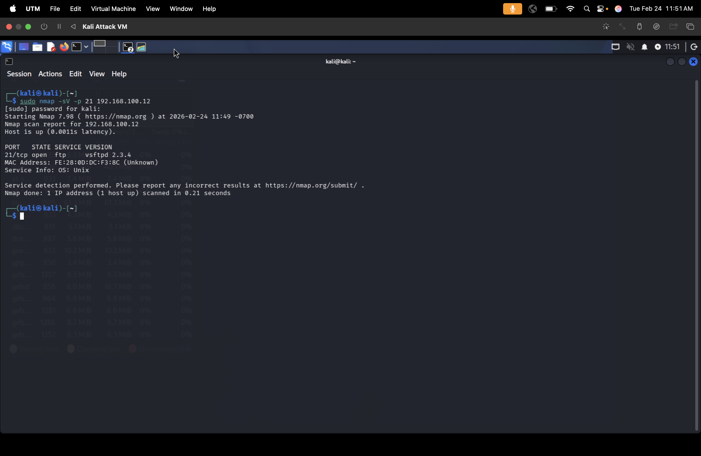

#### **Answers to Questions:**
1️⃣ What version of VSFTPD is running on M2?  
The FTP service running on port 21 is vsftpd 2.3.4

2️⃣ Why is VSFTPD 2.3.4 vulnerable?  
VSFTPD 2.3.4 is vulnerable because a malicious backdoor was added to its source code in 2011 (CVE-2011-2523). This backdoor allows an attacker to gain remote access by logging in with a special username containing a smiley face `:)`.
When this happens, the server opens a hidden shell on port 6200, which can give the attacker root access. This allows remote command execution without proper authorization.

---

### **Task 2: Exploit VSFTPD 2.3.4 Using Metasploit**
#### **Screenshots:**

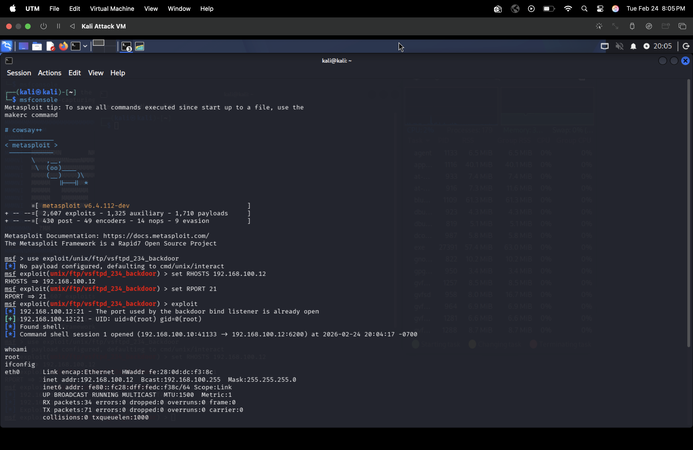
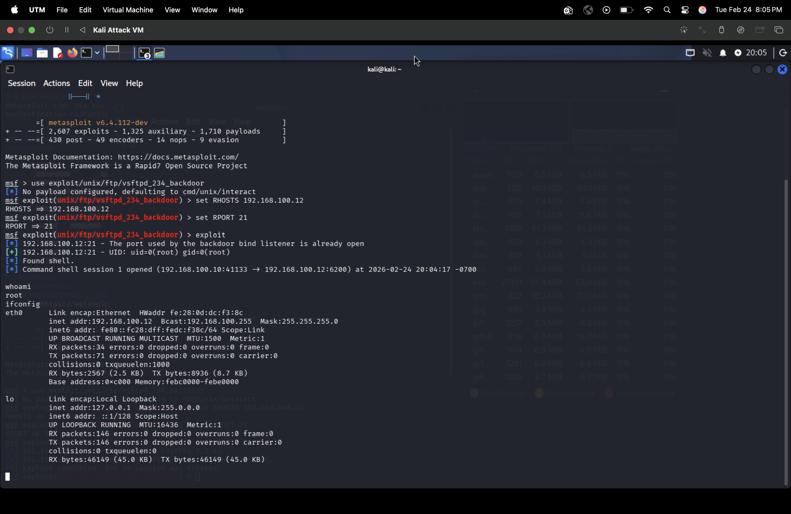

#### **Answers to Questions:**
3️⃣ What happens when the exploit runs successfully?  
When the exploit runs successfully, it connects to the hidden backdoor in VSFTPD 2.3.4 and opens a shell session on the target machine. Metasploit shows that a command shell session has been created. This means I was able to remotely access the system through the vulnerability.

4️⃣ What privileges do you have after exploitation?  
After exploitation, when I ran the whoami command, it showed root.
This means I gained root privileges, which gives full control over the system. With root access, I can execute any command and access all files on the machine.

---

### **Task 3: Analyze the Backdoor in Metasploit Code**
#### **Screenshot:**
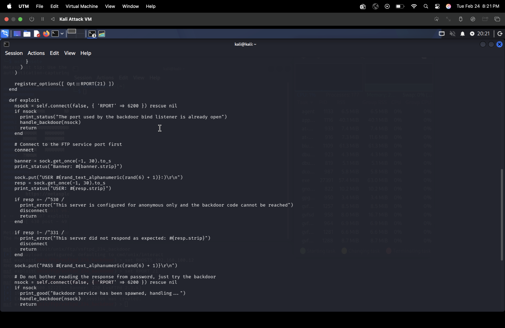

#### **Answers to Questions:**
5️⃣ What does `nsock = self.connect(false, {'RPORT' => 6200}) rescue nil` do?  
This line tries to connect to port 6200 on the target machine. Port 6200 is the hidden backdoor port that opens after the exploit is triggered. If the connection works, it means the backdoor shell is running and ready to accept commands. If it fails, rescue nil prevents the program from crashing and just ignores the error. So basically, this line checks whether the backdoor shell is available.

6️⃣ How does the `:)` username trigger the exploit?
The `:)` triggers the exploit because the malicious version of vsftpd 2.3.4 was modified to check for that exact pattern in the username. When someone logs in with a username that contains `:)`, the hidden backdoor code inside the FTP program gets activated. That code then secretly opens a shell on port 6200.
So basically, the smiley face is like a special trigger. If the server is running the infected version, it recognizes`:)` and opens a root shell. If it is a normal clean version, nothing happens.

---

### **Task 4: Gaining a Shell Without Metasploit (Manual Exploitation)**
#### **Screenshots:**

#### **Answers to Questions:**
7️⃣ Why does the backdoor shell grant root access?  
The backdoor grants root access because the vsftpd service initially runs with root privileges. When the malicious code is triggered by the `:)` username, it opens a shell process that inherits the root permissions of the FTP daemon. Since the service started as root, the backdoor shell also runs as root, giving full system control.

8️⃣ How would you detect and prevent this attack on a real system?  
This attack can be detected by monitoring unexpected open ports such as 6200 and checking logs for suspicious usernames containing unusual characters like `:)`. Network intrusion detection systems can also alert if unknown services suddenly start listening on new ports.To prevent this attack:Install software only from trusted sources, verify software integrity using checksums, keep systems updated, disable unnecessary services, use firewall rules to block unknown ports, regularly monitor logs and system activity.

---

# **Part 3: Exploiting Apache Tomcat Manager (15 pts)**

### **Task 1: Identify the Apache Tomcat Service**
#### **Screenshot:**
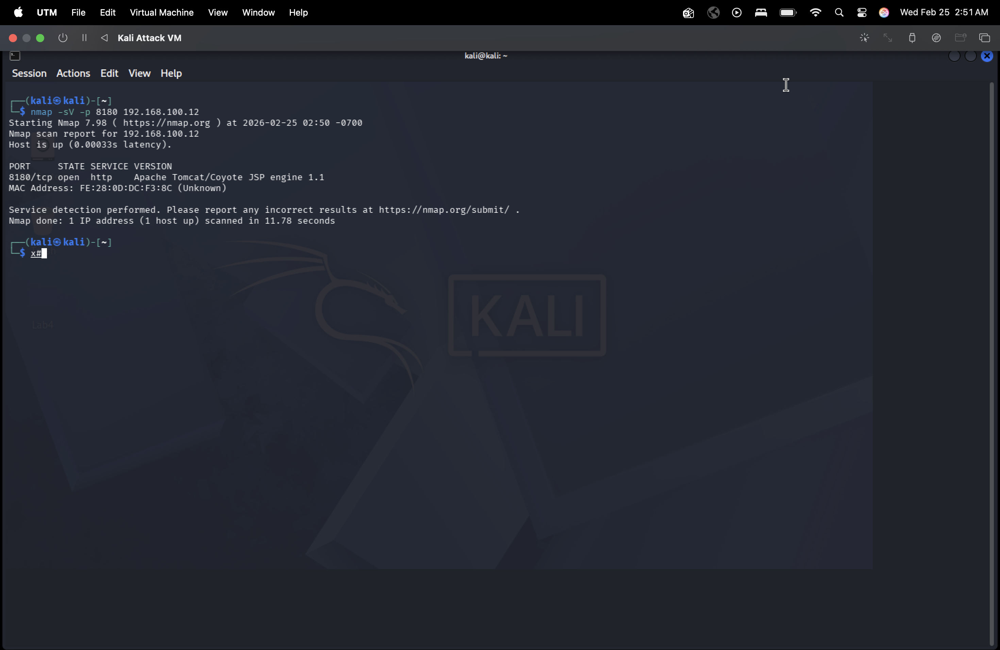

#### **Answer to Question:**
1️⃣ What version of Apache Tomcat is running on M2?  
Apache Tomcat is running with the Coyote JSP engine 1.1 on port 8180. The scan confirms that the Tomcat service is active and reachable from the network.

---

### **Task 2: Check for Weak Credentials**
#### **Screenshot:**
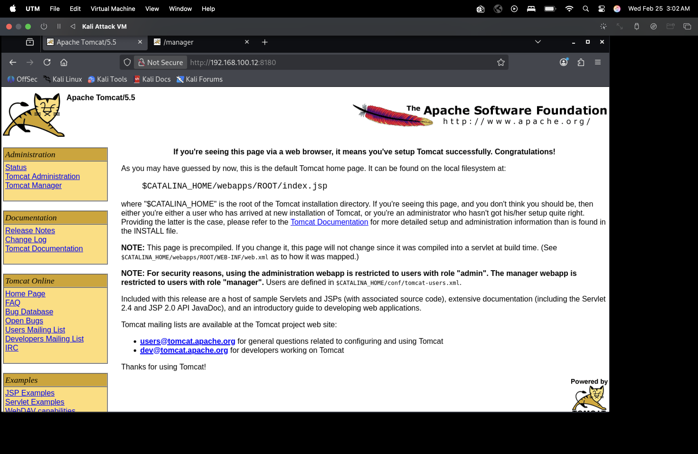
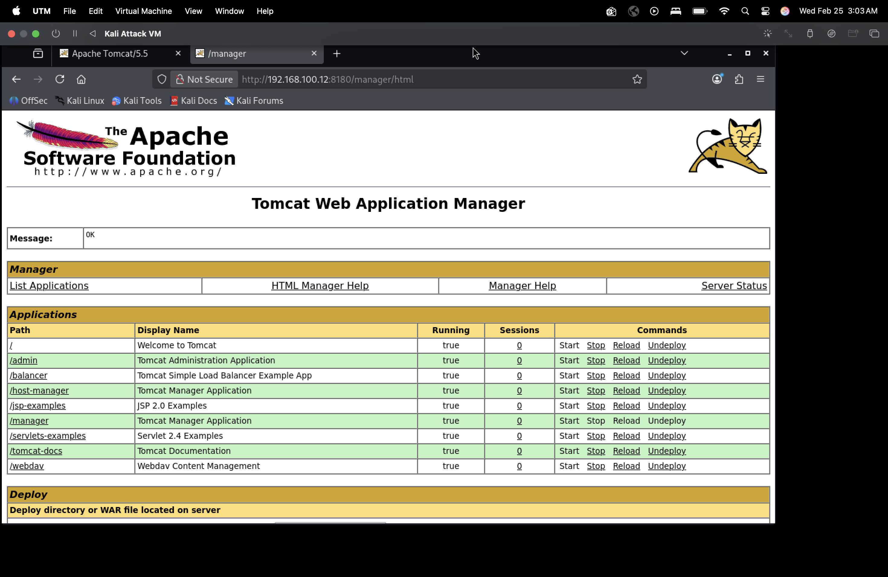
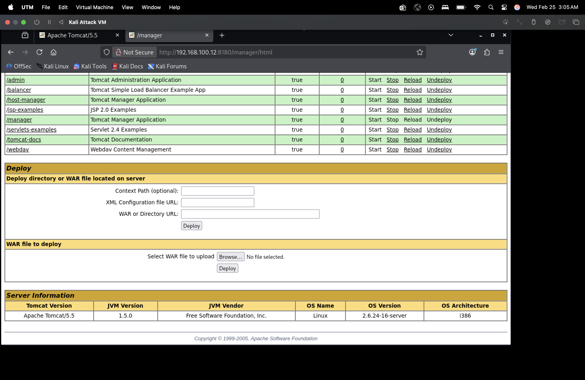

#### **Answer to Question:**
2️⃣ Were you able to log in using the default credentials?  
Yes, I was able to authenticate using the default credentials (tomcat:tomcat).This means the Tomcat Manager interface is exposed and not properly secured.

---

### **Task 3: Exploit Default Tomcat Credentials Using Metasploit**
#### **Screenshots:**
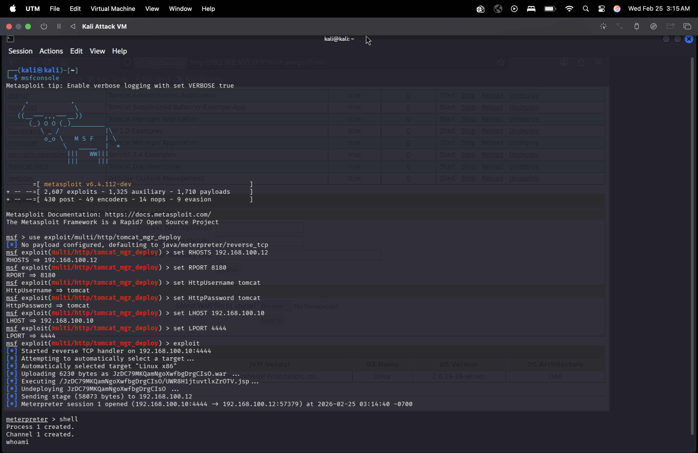

#### **Answers to Questions:**
3️⃣ What does the Tomcat Manager Deploy exploit do?  
This exploit logs into the Tomcat Manager using valid credentials and uploads a malicious WAR file. Once the file is deployed, Tomcat executes it, which runs a payload that creates a reverse shell back to the attacker. So basically, it turns the deployment feature into a remote code execution method.

4️⃣ What kind of access do you get after a successful exploit?  
After exploitation, I get a reverse shell session on the target machine. The access usually runs as the Tomcat service user, not root. Even though it’s not root, I can still:
- Run system commands
- Read and modify files
- Upload more payloads
- Try privilege escalation
So it is still a serious compromise.

---

### **Task 4: Gaining a Reverse Shell**
#### **Screenshot:**
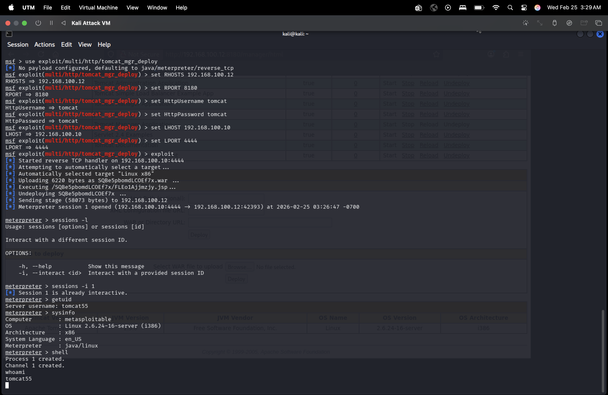

#### **Answers to Questions:**
5️⃣ What risks are associated with default credentials?  
Default credentials create a serious security risk because they are publicly known and easy to guess. If they are not changed, attackers can log into administrative interfaces without needing advanced skills. In this case, using the default tomcat:tomcat credentials allowed access to the Tomcat Manager. From there, a malicious WAR file was uploaded, which resulted in remote code execution and a reverse shell.
This means Unauthorized users can gain admin access, Malicious applications can be deployed, Remote command execution becomes possible. Default credentials basically remove the first layer of security.

6️⃣ How would you prevent this attack in a real-world environment?  
To prevent this type of attack:
1. Change all default usernames and passwords immediately
2. Use strong and unique credentials
3. Disable the Tomcat Manager application if not required
4. Restrict access to the Manager interface using firewall rules
5. Allow only trusted internal IP addresses
6. Use HTTPS instead of HTTP
7. Monitor logs for unusual login or deployment activity
8. Keep Tomcat updated with security patches
This attack succeeds mainly because of poor configuration. Proper security practices would prevent it.

---

# **Part 4: Exploiting PostgreSQL (15 pts)**

### **Task 1: Identify the PostgreSQL Service**
#### **Screenshot:**
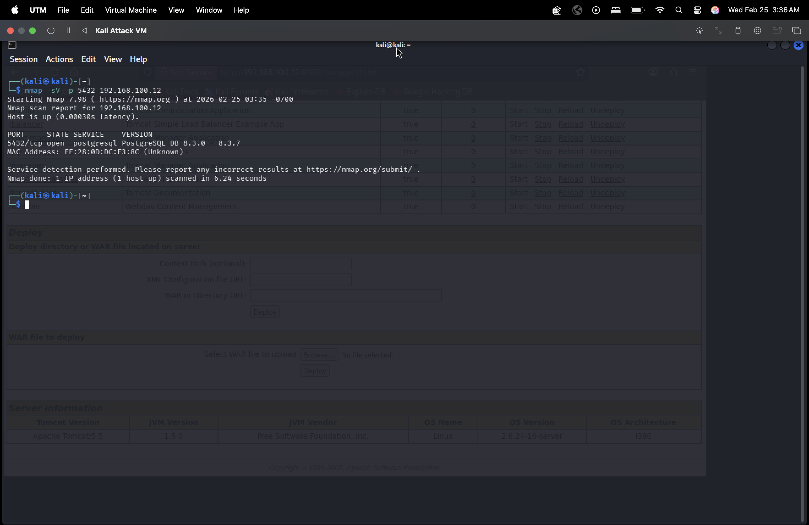

#### **Answers to Questions:**
1️⃣ What version of PostgreSQL is running on M2?  
The Nmap scan shows that PostgreSQL version 8.3.x (8.3.0–8.3.7) is running on Metasploitable-2. Port 5432 is open and the service is identified as PostgreSQL DB 8.3.

2️⃣ Why is it important to check the version of a database service before attacking?  
It is important to check the version because different versions have different vulnerabilities. Some exploits only work on specific versions, so knowing the exact version helps in selecting the correct attack method. It also helps determine whether the service is outdated and potentially vulnerable to known public exploits.

---

### **Task 2: Check for Weak PostgreSQL Authentication**
#### **Screenshots:**
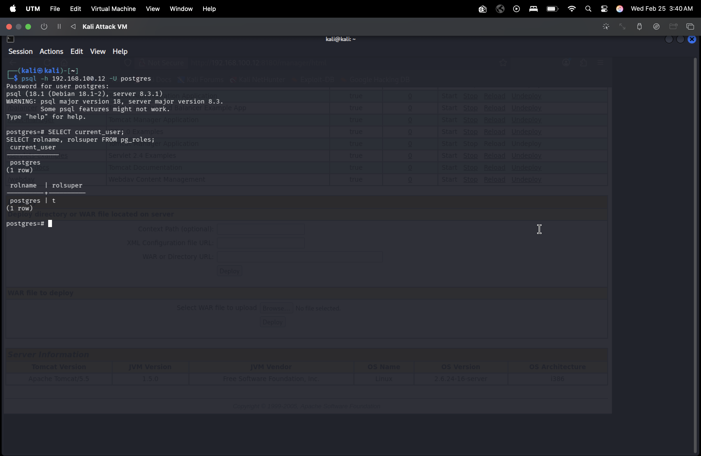

#### **Answers to Questions:**
3️⃣ Were you able to connect with default credentials?  
Yes, the connection was successful using the default username postgres and password postgres. The PostgreSQL prompt appeared, which confirms that the login worked. This shows that the database is using weak default credentials.

4️⃣ What privileges does the `postgres` user have?  
The query result shows that rolsuper = t for the postgres user. This means the postgres account has superuser privileges. A superuser has full control over the database, including managing users, modifying data, and performing administrative actions. This makes the compromise serious because full database access is obtained.

---

### **Task 3: Exploit PostgreSQL for Remote Code Execution**
#### **Screenshots:**
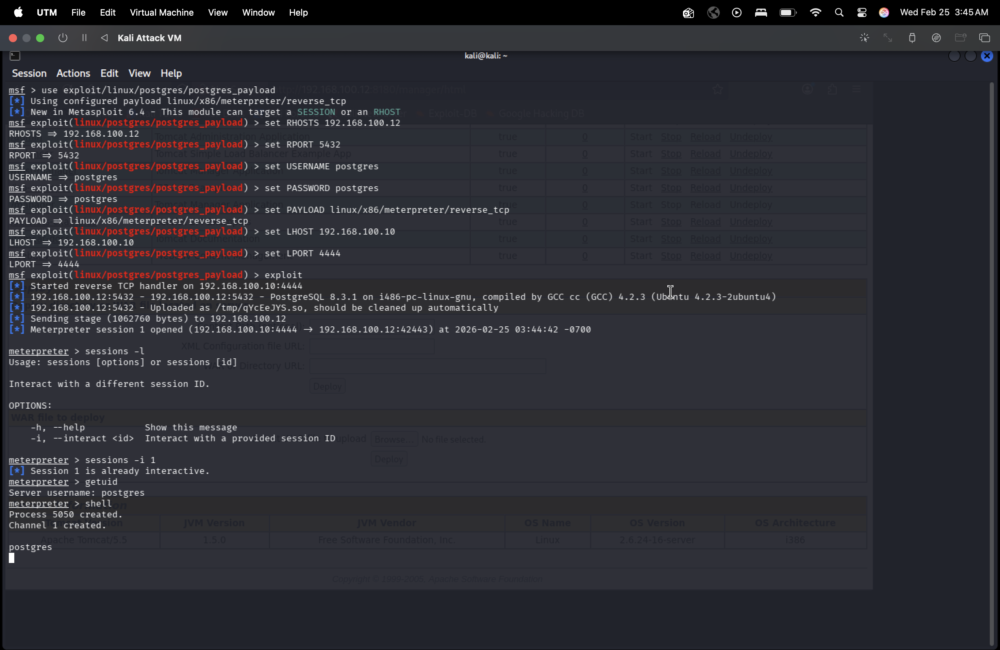

#### **Answer to Question:**
5️⃣ What happens when this exploit runs successfully?  
When the exploit runs successfully, it logs into the PostgreSQL database using the provided credentials and uploads a malicious payload. The payload then executes on the target system and creates a reverse connection back to the attacker machine. This opens a Meterpreter session, which allows remote command execution. The session runs as the postgres user.

---

# **Part 5: Writing and Testing the VSFTPD 2.3.4 Exploit (40 pts)**

### **Task 1: Writing a Ruby Exploit for VSFTPD 2.3.4**
#### **Code Submission:**
*(Attach `vsftpd_exploit.rb` as a separate file.)*

#### **Screenshots:**
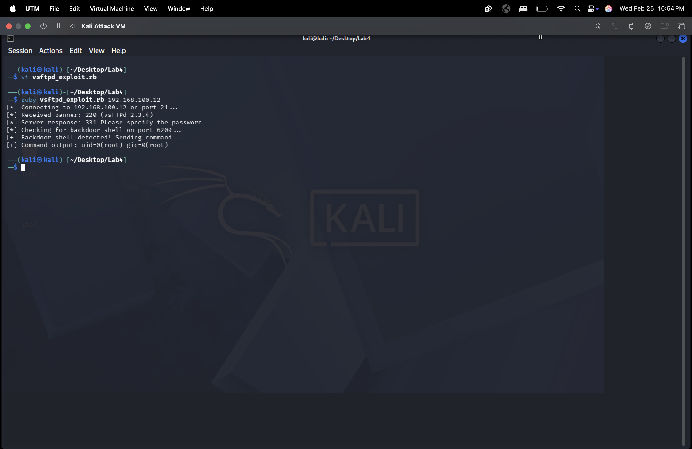

#### **Answers to Questions:**
1️⃣ What does `TCPSocket.new(target_ip, ftp_port)` do?  
It creates a TCP connection from the attacker machine to the target machine on the specified port. In this case, it connects to the FTP service running on port 21 so the script can send commands to it.

2️⃣ Why does the exploit send `USER hacker:)`?  
The `:)` is used to trigger the hidden backdoor in the malicious version of vsftpd 2.3.4. When the server sees a username containing `:)`, it activates the backdoor and opens a shell on port 6200.

3️⃣ What is the purpose of connecting to port 6200 after sending the malicious username?  
Port 6200 is where the backdoor shell opens if the server is vulnerable. After triggering it, connecting to port 6200 allows running commands on the system and getting root access.

4️⃣ What was missing/incorrect in the starter Ruby code, and how did you fix it?  
The starter code did not properly complete the FTP login process. After sending USER hacker`:)`, it was missing the PASS command. I fixed it by adding ftp_socket.puts("PASS password\r\n") so the FTP session continues correctly and the backdoor can trigger. I also made sure the correct port numbers (21 and 6200) were set and adjusted how the script reads the output.

5️⃣ How can system administrators prevent or quickly detect such backdoor exploits?  
Administrators should keep software updated and only install programs from trusted sources. They can also monitor for unusual open ports like 6200 and check logs for suspicious login attempts. Regular patching and monitoring help prevent this kind of attack.

---

### **Task 2: Rewriting the Exploit in Python**
#### **Code Submission:**
*(Attach `vsftpd_exploit.py` as a separate file.)*

#### **Screenshot:**
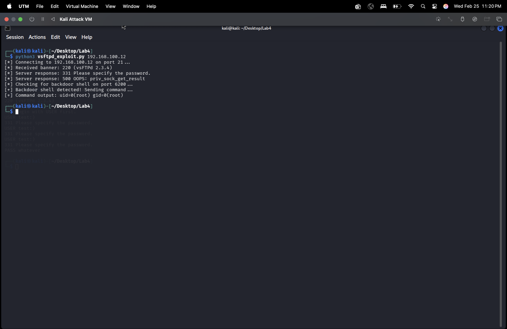

#### **Answers to Questions:**
1️⃣ What are the main differences between the Ruby and Python exploits?  
The main difference is how each language handles socket communication. In Ruby, we used TCPSocket.new which makes the connection in a simple and direct way. In Python, we used the socket module and create_connection(), which feels a bit more detailed. Python also required explicit encoding and decoding of data when sending and receiving responses, while Ruby handled strings more directly. Overall, both scripts follow the same logic (connect to FTP, trigger backdoor, connect to port 6200), but the syntax and way of handling data is slightly different.

2️⃣ Which language was easier to use for writing this exploit? Why?  
For me, Python was slightly easier because the structure of the code felt more organized. The socket functions were clear, and handling exceptions like timeouts was straightforward. Since I use Python more often, I felt more comfortable writing and modifying the exploit in Python.

3️⃣ What are the advantages of using Metasploit vs. writing exploits manually?  
Metasploit is faster and easier because it already has built-in exploit modules. You just set the target and run it. It also manages sessions automatically. Writing exploits manually takes more effort, but it helps understand how the vulnerability actually works.

4️⃣ What real-world security lessons did you learn from this vulnerability?  
This vulnerability shows how dangerous supply chain attacks can be. A small hidden backdoor in software can give attackers full root access. It also shows why keeping software updated and verifying its integrity is very important. Monitoring unusual open ports and system behavior can help detect such attacks early.
